# Image Stitching by Line-guided Local Warping with Global Similarity Constraint (PR2018)

A collection of image stitching datasets used for image stitching by line-guided local warping with global similarity constraint, PR, 2018. 

Recent image stitching work can be found in: [awesome-computational-photography](https://github.com/visionxiang/awesome-computational-photography).

## Content
- [Traditional Image Stitching](#Traditional-Image-Stitching)
  - [SVA Dataset (2011)](#SVA)
  - [APAP Dataset (2013)](#APAP)
  - [Parallax-tolerant Stitching Dataset (2014)](#Parallaxtolerant)
  - [SPHP Dataset (2014)](#SPHP)
  - [Stereostitch Dataset (2015)](#Stereostitch)
  - [NISwGSP Dataset (2016)](#NISwGSP)
  - [SEAGULL Dataset (2016)](#SEAGULL)
  - [REW Dataset (2018)](#REW)
  - [Dataset - Multiple Registrations (2018)](#multiregis)
  - [Object-Centered Stitching Dataset (2018)](#objcenter)
  - [BRAS Dataset (2019)](#BRAS)
  - [SPW Dataset (2020)](#SPW)
  - [VPG Dataset (2020)](#VPG)
  - [LPC Dataset (2021)](#LPC)
  - [GES-50 (2022)](#GES50)
  - [Color Consistency Dataset (2019)](#colorconsistency)
  - [OpenPano Dataset (2016)](#openpano)
- [Deep Learning Image Stitching](#Deep-Learning-Image-Stitching)
  - [Hmg-dynamics (2020)](#hmgdynamics)
  - [Content-Aware-DeepH-Data (2020)](#CADH)
  - [UDIS-D (2021)](#UDISD)
  - [DIR-D (2022)](#DIRD)
  - [WSSN Dataset (2022)](#WSSN)

## Traditional Image Stitching

### SVA Dataset (2011)

&emsp; 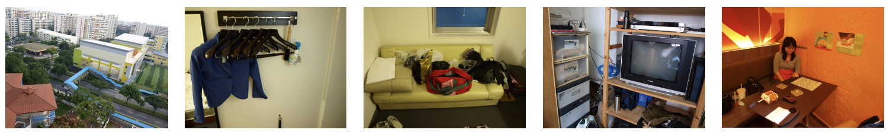      
- Paper: [Smoothly varying affine stitching](https://ieeexplore.ieee.org/abstract/document/5995314), CVPR2011   
- Project: No 
- Download: [dataset](https://drive.google.com/drive/folders/1FciKXGD0p_5Ly8_gQDkM2WUdSNRvxBuC?usp=sharing)
- Details: The dataset contains 5 sets of images for image stitching, ranging from 2 to 3 images. 

### APAP Dataset (2013)

&emsp;   
- Paper: As-Projective-As-Possible Image Stitching with Moving DLT, [CVPR2013](https://cs.adelaide.edu.au/~tjchin/apap/files/mdlt.pdf), [TPAMI2014](https://cs.adelaide.edu.au/~tjchin/apap/files/tpami_mdlt_lowres.pdf)    
- Project: [Official](https://cs.adelaide.edu.au/~tjchin/apap/), [Python Code](https://github.com/EadCat/APAP-Image-Stitching), [C++](https://github.com/egoist-sx/AsProjectiveAsPossible)  
- Download: [dataset](https://cs.adelaide.edu.au/~tjchin/apap/#Datasets)  
- Details: 8 sets of images, including railtracks, temple, carpark, apartment, chess/girl, construction site, and garden.    
- Reference:   
[18] Smoothly varying affine stitching, CVPR2011.   
[22] Constructing image panoramas using dual-homography warping, CVPR2011.

<!-- Dataset No bikes -->

### Parallax-tolerant Stitching Dataset (2014)

&emsp; 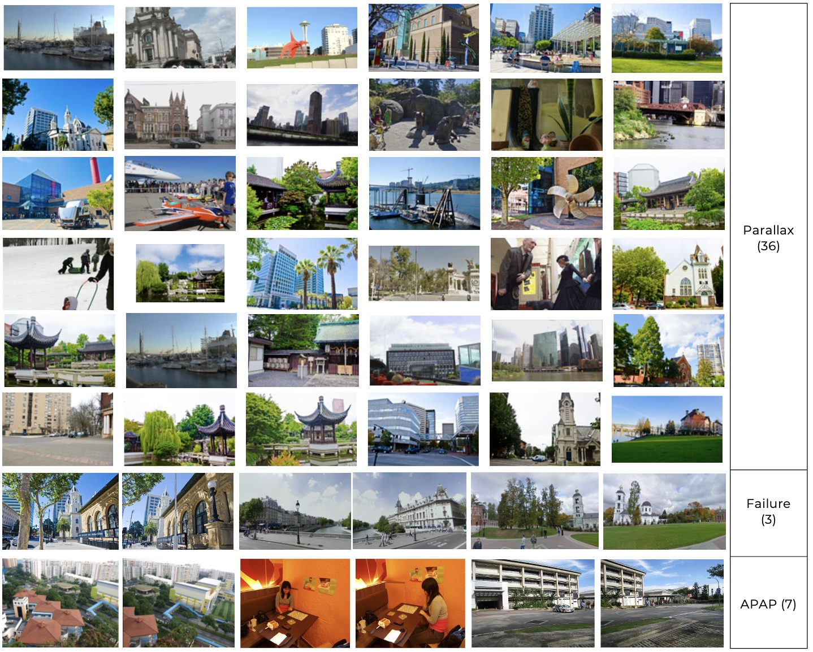      
- Paper: [Parallax-tolerant Image Stitching](https://pages.cs.wisc.edu/~fliu/papers/cvpr2014-stitching.pdf), CVPR2014  
- Project: https://pages.cs.wisc.edu/~fliu/project/stitch/index.htm  
- Download: [Zip](https://pages.cs.wisc.edu/~fliu/project/stitch/dataset.zip), [Imgs](https://web.cecs.pdx.edu/~fliu/project/stitch/dataset.html)
- Details: The dataset contains 36 sets of images for two-view image stitching.   

### SPHP Dataset (2014)

&emsp;     
- Paper: [Shape-Preserving Half-Projective Warps for Image Stitching](https://openaccess.thecvf.com/content_cvpr_2014/papers/Chang_Shape-Preserving_Half-Projective_Warps_2014_CVPR_paper.pdf), CVPR2014  
- Related Paper: [Spatially-Varying Image Warps for Scene Alignment](https://www.csie.ntu.edu.tw/~cyy/publications/papers/Chang2014SVI.pdf), ICPR2014  
- Project: [Code]  
- Download: [Google Drive]()  
- Details: Add another 7 sets of images for image stitching based on the APAP dataset.   

### Stereostitch Dataset (2015)

&emsp; 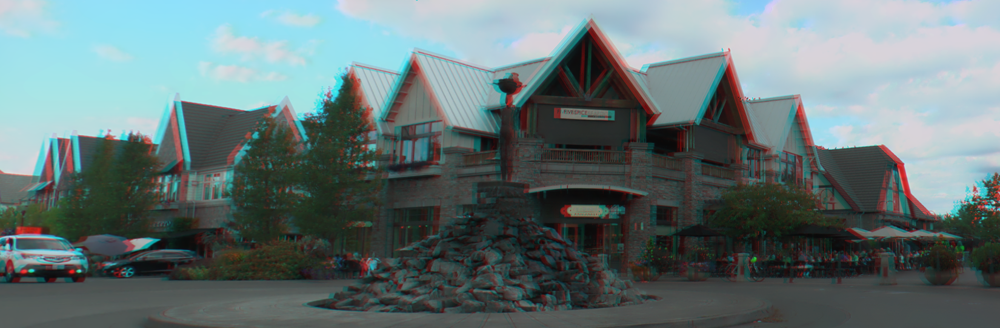    
- Paper: [Casual Stereoscopic Panorama Stitching](https://pages.cs.wisc.edu/~fliu/papers/cvpr2015-panorama.pdf), CVPR2015  
- Project: https://pages.cs.wisc.edu/~fliu/project/stereostitch/   
- Download: [dataset](https://pages.cs.wisc.edu/~fliu/project/stereostitch/dataset.zip)  
- Details: The dataset contains 22 sets of images (incl. one group of images for 360 stitching), taken by stereo cameras Fujifilm FinePix 3D W3 and Panasonic HDC-Z10000. Each set of images includes both the left images and right images exhibiting large parallax.  

### NISwGSP Dataset (2016)

&emsp; 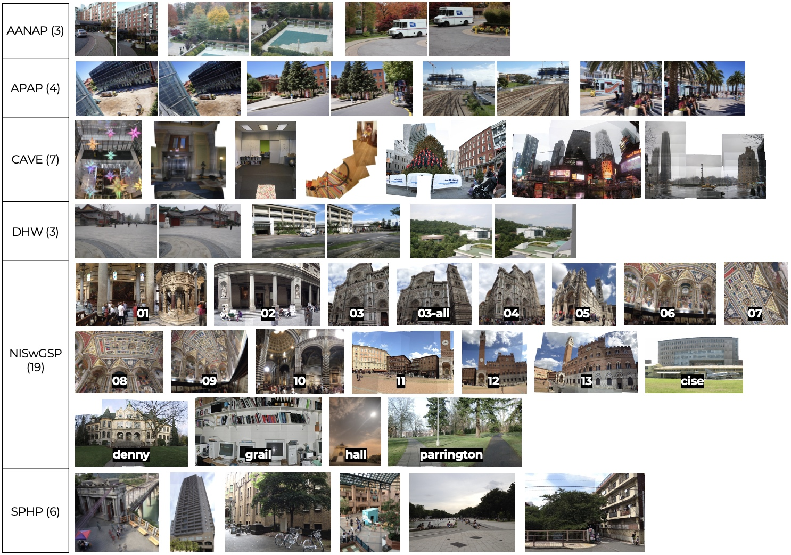   
- Paper: [Natural Image Stitching with the Global Similarity Prior](https://link.springer.com/chapter/10.1007/978-3-319-46454-1_12), ECCV2016   
- Project: https://github.com/nothinglo/NISwGSP  
- Download: [Google Drive]()  
- Details: it contains 42 sets of images for image stitching. Many sets of images contain multiple images (> 2) for stitching.   

### SEAGULL Dataset (2016)

&emsp; 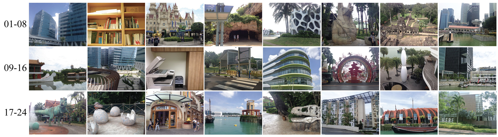   
- Paper: [SEAGULL: Seam-Guided Local Alignment for Parallax-Tolerant Image Stitching](https://link.springer.com/chapter/10.1007/978-3-319-46487-9_23), ECCV2016   
- Project:  
- Download: (Link expired)
- Details: it contains 24 pairs of images taken by the author using mobile phones with challenging parallax variation.

### REW Dataset (2018)

&emsp; 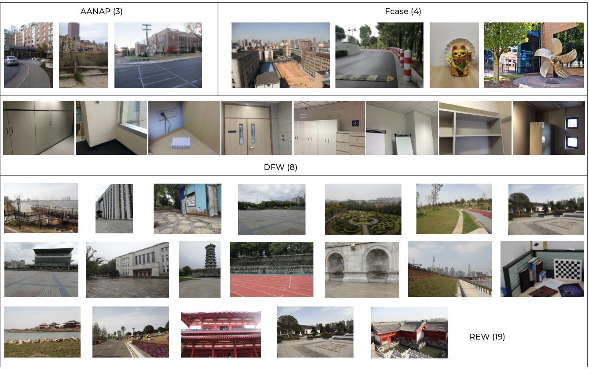   
- Paper: [Parallax-Tolerant Image Stitching Based on Robust Elastic Warping](https://ieeexplore.ieee.org/document/8119833), TMM2018
- Project: [Official Code](https://github.com/gain2217/Robust_Elastic_Warping), [Python](https://github.com/breadcake/python-Robust_Elastic_Warping)
- Download: [dataset](https://github.com/gain2217/Robust_Elastic_Warping)
- Dataset: it contains two-view and multi-view image groups for image stitching.

### Dataset for Stitching with Multiple Registrations (2018)

&emsp; 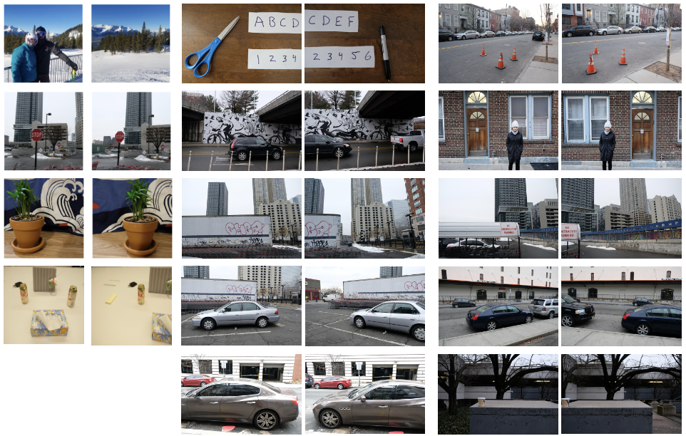   
- Paper: [Robust Image Stitching with Multiple Registrations](https://drive.google.com/file/d/1BWdkiJJHBSn9JNaMVhhD1WHD8upK51AH/view), ECCV2018
- Project: https://sites.google.com/view/oois-eccv18/home?authuser=0 
- Download: [Google Drive](https://drive.google.com/open?id=1RNfs8I9NZu6A2FGT6Ba86nfEBOgbPdSp)
- Details: It contains 14 sets of images. 

### Object-Centered Stitching Dataset (2018)

&emsp; 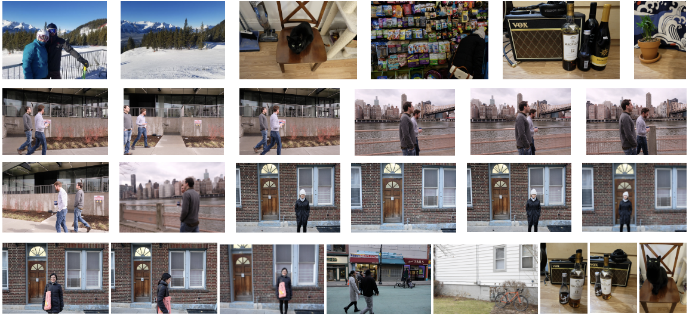   
- Paper: [Object-centered image stitching](https://drive.google.com/file/d/1_YnPNNWzNphdrd_51lXL7q-jm5N3Cttn/view), ECCV2018
- Project: https://sites.google.com/view/oois-eccv18/home?authuser=0
- Download: [dataset](https://drive.google.com/open?id=1OIDwCcmVlSMqrLmwPBA8G2A5G4NgcQMF)
- Details: It contains 26 sets of images. 

### BRAS Dataset (2019)

&emsp; 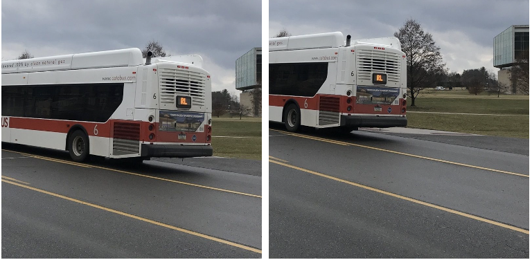   
- Paper: [Robust Alignment for Panoramic Stitching Via an Exact Rank Constraint](https://ieeexplore.ieee.org/abstract/document/8684316), TIP2019 
- Project: http://signal.ee.psu.edu/research/BRAS.html
- Download: [dataset](http://signal.ee.psu.edu/research/BRAS.html)
- Details: One group of catabus images

### SPW Dataset (2020)

&emsp; 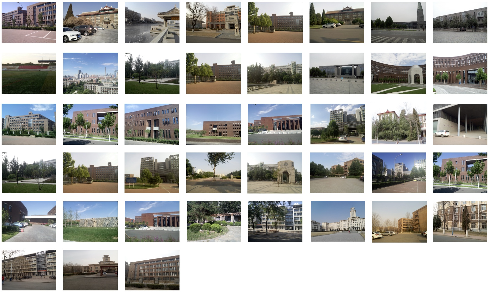   
- Paper: [Single-Perspective Warps in Natural Image Stitching](https://arxiv.org/abs/1802.04645), TIP2020   
- Project: https://github.com/tlliao/Single-perspective-warps
- Download: [dataset](https://github.com/tlliao/Single-perspective-warps/tree/master/Images)
- Details: contains 42 sets of image pairs for stitching. 

### VPG Dataset (2020)

&emsp; 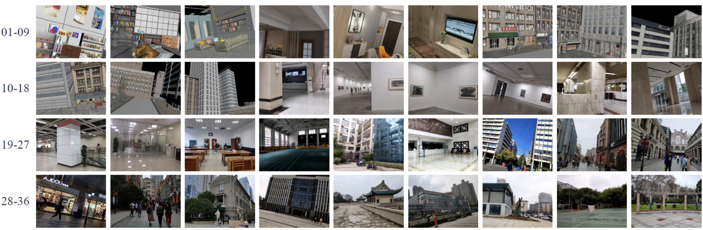   
- Paper: [Vanishing Point Guided Natural Image Stitching](https://arxiv.org/pdf/2004.02478.pdf), arXiv2020   
- Project: http://cvrs.whu.edu.cn/projects/VPGStitching/
- Download: [dataset]
- Details: The dataset contains 36 sets of images, of which 12 sets of synthetic images and 24 sets of real images. All synthetic images were generated through 3Ds Max rendering hence the associated parameters are known. All real images were captured by a mobile phone. The VPG dataset contains both indoor scenes and outdoor street-view scenes. All images were carefully collected to ensure the Manhattan assumption. The number of images involved in stitching in each set ranges from 5 to 72.

### LPC Dataset (2021)

&emsp; 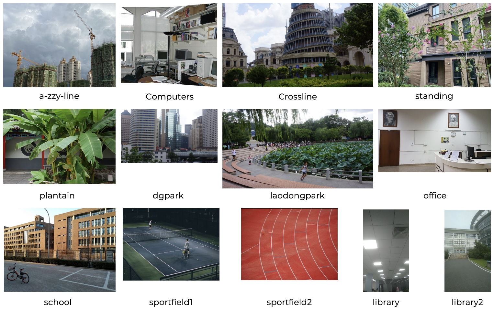   
- Paper: [Leveraging Line-point Consistence to Preserve Structures for Wide Parallax Image Stitching](https://openaccess.thecvf.com/content/CVPR2021/papers/Jia_Leveraging_Line-Point_Consistence_To_Preserve_Structures_for_Wide_Parallax_Image_CVPR_2021_paper.pdf), CVPR2021  
- Project: https://github.com/dut-media-lab/Image-Stitching
- Download: [dataset](https://github.com/dut-media-lab/Image-Stitching/tree/main/Imgs)
- Details: Add about 13 image pairs for image stitching.

### GES-50 (2022)

&emsp; 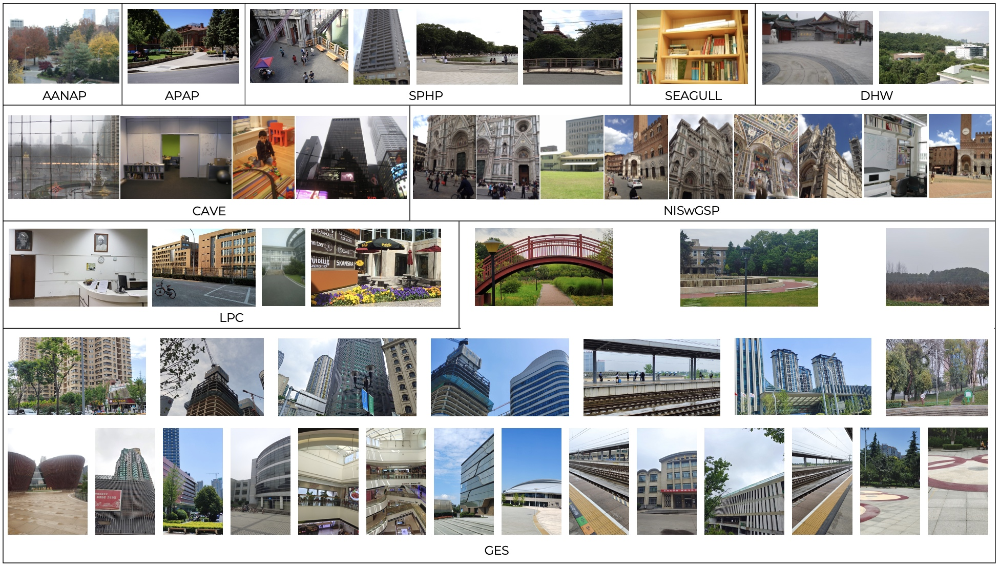   
- Paper: [Geometric Structure Preserving Warp for Natural Image Stitching](https://openaccess.thecvf.com/content/CVPR2022/html/Du_Geometric_Structure_Preserving_Warp_for_Natural_Image_Stitching_CVPR_2022_paper.html), CVPR2022   
- Project: https://github.com/flowerDuo/GES-GSP-Stitching
- Download: [dataset](https://github.com/flowerDuo/GES-GSP-Stitching/tree/master/Dataset)
- Details: There are 50 diversified and challenging image groups (26 from the previous dataset and 24 collected by this work). The number of images ranges from 2 to 35.

### Color Consistency Dataset (2019)

&emsp; 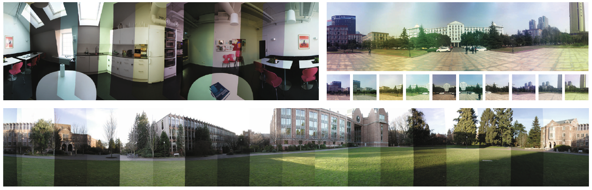   
- Paper: [A Closed-Form Solution for Multi-view Color Correction with Gradient Preservation](https://menghanxia.github.io/papers/2019_Color_Consistency_Optimization_isprs_journal.pdf), ISPRSJ2019    
- Project: https://github.com/MenghanXia/ColorConsistency
- Download: [dataset](https://github.com/MenghanXia/ColorConsistency)
- Details: It contains 3 sets of images for color correction in image stitching, including campus, lunchroom, and school building.

### OpenPano Dataset (2016)

&emsp; 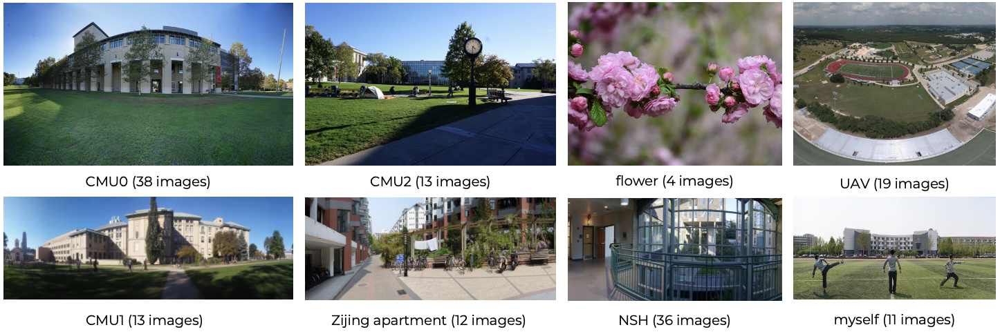   
- Paper: Open-source panorama stitching program written in C++ from scratch. 
- Project: https://github.com/ppwwyyxx/OpenPano
- Download: [dataset](https://github.com/ppwwyyxx/OpenPano/releases/tag/0.1)
- Details: It contains 8 sets of images for panorama stitching, and the number of images for each set ranges from 4 to 38.

## Deep Learning Image Stitching

### Hmg-dynamics (2020)

&emsp; 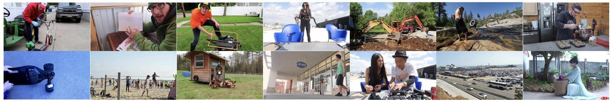
- Paper: [Deep Homography Estimation for Dynamic Scenes](https://openaccess.thecvf.com/content_CVPR_2020/papers/Le_Deep_Homography_Estimation_for_Dynamic_Scenes_CVPR_2020_paper.pdf), CVPR2020  
- Project: https://github.com/lcmhoang/hmg-dynamics
- Download: 
- Details: Authors downloaded 877 videos with a Creative Commons License from YouTube. From these videos, they extracted 32,385 static video clips and then applied a known homography sequence to each of them to generate image/video pairs.

### Content-Aware-DeepH-Data (2020)

&emsp; 
- Paper: [Content-Aware Unsupervised Deep Homography Estimation](https://arxiv.org/pdf/1909.05983.pdf), ECCV2020
- Project: https://github.com/JirongZhang/DeepHomography
- Download: [dataset](https://drive.google.com/file/d/19d2ylBUPcMQBb_MNBBGl9rCAS7SU-oGm/view?usp=sharing)
- Related Paper: [Semi-supervised Deep Large-baseline Homography Estimation with Progressive Equivalence Constraint](https://github.com/megvii-research/LBHomo), AAAI 2023   
- Details: The dataset contains 5 categories of a total of 80k image pairs, including regular (RE), low-texture (LT), low-light (LL), small-foregrounds (SF), and large-foregrounds (LF) scenes, with each category ≈16k image pairs. For the test data, 4.2k image pairs are randomly chosen from all categories.

### UDIS-D (2021)

&emsp; 
- Paper: [Unsupervised Deep Image Stitching: Reconstructing Stitched Features to Images](https://arxiv.org/abs/2106.12859), TIP2021  
- Project: https://github.com/nie-lang/UnsupervisedDeepImageStitching  
- Download: [dataset](https://github.com/nie-lang/UnsupervisedDeepImageStitching) 
- Related Paper: [Parallax-Tolerant Unsupervised Deep Image Stitching](https://arxiv.org/abs/2302.08207), ICCV2023, [[``Proj``]](https://github.com/nie-lang/UDIS2)
- Details: It is an unsupervised deep image stitching dataset, including 10,440 cases for training and 1,106 for testing.

### DIR-D (2022)

&emsp; 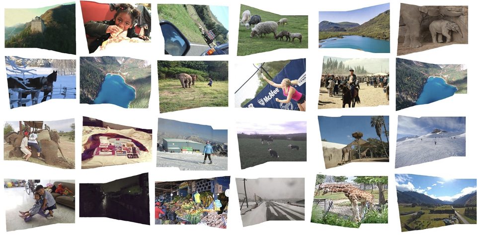
- Paper: [Deep Rectangling for Image Stitching: A Learning Baseline](https://arxiv.org/pdf/2203.03831.pdf), CVPR2022 
- Project: https://github.com/nie-lang/DeepRectangling
- Download: [dataset](https://drive.google.com/file/d/1KR5DtekPJin3bmQPlTGP4wbM1zFR80ak/view?usp=sharing) 
- Details: DIR-D dataset with a wide range of irregular boundaries and scenes, which includes 5,839 samples for training and 519 samples for testing. Every image in the dataset has a resolution of 512×384. The DIR-D dataset is a synthesized dataset from the UDIS-D and MS-COCO datasets, in which each sample is a triplet consisting of a stitched image (I), a mask (M), and a rectangling label (R).

### WSSN Dataset (2022)

&emsp; 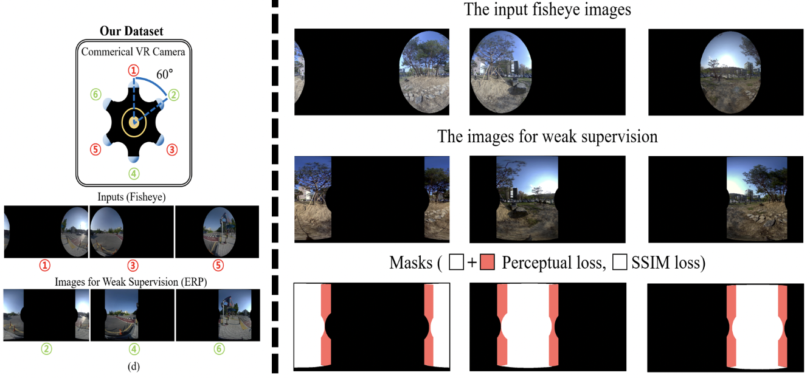
- Paper: [Weakly-Supervised Stitching Network for Real-World Panoramic Image Generation](https://arxiv.org/abs/2209.05968), ECCV2022 
- Project: https://eadcat.github.io/WSSN/
- Download: [dataset](https://drive.google.com/file/d/1p27k77TWjknBYJ62EW97D2Xf_nElNZW3/view?usp=sharing), [code](https://github.com/EadCat/WeaklySupervisedStitchingNetwork) 
- Details: The dataset is a fisheye image dataset collected by a commercial VR camera called Kandao Obsidian R for image stitching. It can capture six fisheye images simultaneously using six lenses rotated at 60° intervals. Three fisheye images rotated by 0°, 120°, and 240° as inputs to the stitching model while the remaining three images rotated by 60°, 180°, and 300° are utilized as weak supervisions. In this dataset, 47,063 sets of images are used for the training and 1,400 for the test. Each training set includes three input fisheye images, three ERP images for weak supervision, and three masks.

