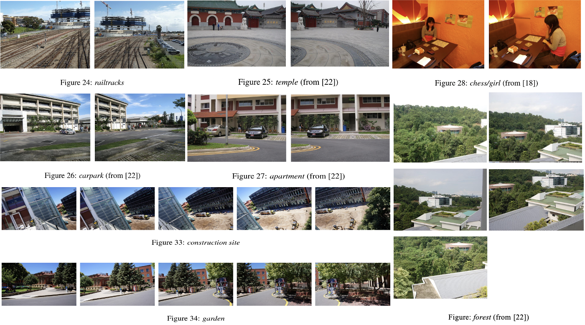

# Image Stitching by Line-guided Local Warping with Global Similarity Constraint (PR2018)

A collection of image stitching datasets used for image stitching by line-guided local warping with global similarity constraint, PR, 2018. 

Recent image stitching work can be found in: [awesome-computational-photography](https://github.com/visionxiang/awesome-computational-photography).

<!--
Dataset Name
Imgs
Paper: 
Project: 
Download:  
Related paper
Details
--> 

## Traditional Image Stitching

### APAP Dataset

&emsp; 

- Paper: As-Projective-As-Possible Image Stitching with Moving DLT, [CVPR2013](https://cs.adelaide.edu.au/~tjchin/apap/files/mdlt.pdf), [TPAMI2014](https://cs.adelaide.edu.au/~tjchin/apap/files/tpami_mdlt_lowres.pdf)    
- Project: [Official](https://cs.adelaide.edu.au/~tjchin/apap/), [Python Code](https://github.com/EadCat/APAP-Image-Stitching)  
- Download: https://cs.adelaide.edu.au/~tjchin/apap/#Datasets  
- Dataset: 8 sets of images, including railtracks, temple, carpark, apartment, chess/girl, construction site, and garden.    
- Reference:   
[18] Smoothly varying affine stitching, CVPR2011.   
[22] Constructing image panoramas using dual-homography warping, CVPR2011.

<!--BAMDLT code is expired. Dataset No couch(from[18]), rooftops(from[18]), bikes, train-->

## Deep Learning Image Stitching

### UDIS-D

&emsp; 

- Paper: [Unsupervised Deep Image Stitching: Reconstructing Stitched Features to Images](https://arxiv.org/abs/2106.12859), TIP2021  
- Project: https://github.com/nie-lang/UnsupervisedDeepImageStitching  
- Download: https://github.com/nie-lang/UnsupervisedDeepImageStitching 
- Related Paper: [Parallax-Tolerant Unsupervised Deep Image Stitching](https://arxiv.org/abs/2302.08207), ICCV2023, [[``Proj``]](https://github.com/nie-lang/UDIS2)
- Dataset: It is an unsupervised deep image stitching dataset, including 10,440 cases for training and 1,106 for testing.

