<h1 align="center">Image Stitching Datasets</h1>

<p align="center">
  A curated collection of publicly available datasets for image stitching,<br>
  covering traditional warping-based methods, deep learning approaches, and related tasks.
</p>

<p align="center">
  <a href="https://arxiv.org/abs/1702.07935"></a>
  <a href="https://drive.google.com/file/d/1MQn74x-tSGOtIBLqy4kFx1Wt2-fi4uKX/view?usp=sharing"></a>
  <a href="https://www.sciencedirect.com/science/article/abs/pii/S0031320318302231"></a>
  
  
</p>

This collection was first assembled for our paper **Image Stitching by Line-guided Local Warping with Global Similarity Constraint** (Pattern Recognition, 2018). If you find it useful, please cite:

```bibtex
@article{xiang2018image,
  title={Image Stitching by Line-guided Local Warping with Global Similarity Constraint},
  author={Xiang, Tian-Zhu and Xia, Gui-Song and Bai, Xiang and Zhang, Liangpei},
  journal={Pattern Recognition},
  volume={83},
  pages={481--497},
  year={2018},
  publisher={Elsevier}
}
```

> Looking for recent image stitching papers and code? See [awesome-computational-photography](https://github.com/visionxiang/awesome-computational-photography).


## Contents

- [Overview](#overview)
- [Traditional Image Stitching](#traditional-image-stitching)
- [Deep Learning Image Stitching](#deep-learning-image-stitching)
- [Video Stitching](#video-stitching)
- [Panoramic and Surround-view Stitching](#panoramic-and-surround-view-stitching)
- [Aerial and Remote Sensing Stitching](#aerial-and-remote-sensing-stitching)
- [Rectangling and Rotation Correction](#rectangling-and-rotation-correction)
- [Homography Estimation](#homography-estimation)
- [Other Related Datasets](#other-related-datasets)
- [Announced, Not Yet Released](#announced-not-yet-released)
- [Contributing](#contributing)


## Overview

Datasets are listed chronologically within each category. *Sets* is the number of image groups; *Type* tells whether each group is a two-image pair or a multi-image sequence. Train / test splits are written as `train / test`.

| Dataset                                                                           | Year  |     Venue     |                 Sets | Images / set |             Type             | Download                                                                                              |
| :-------------------------------------------------------------------------------- | :---: | :-----------: | -------------------: | :----------: | :--------------------------: | :---------------------------------------------------------------------------------------------------- |
| **Traditional**                                                                   |       |               |                      |              |                              |                                                                                                       |
| [SVA](#sva-dataset-2011)                                                          | 2011  |     CVPR      |                    5 |     2–3      |          multi-view          | [Google Drive](https://drive.google.com/drive/folders/1FciKXGD0p_5Ly8_gQDkM2WUdSNRvxBuC?usp=sharing)  |
| [APAP](#apap-dataset-2013)                                                        | 2013  | CVPR / TPAMI  |                    8 |      2       |           two-view           | [Project page](https://cs.adelaide.edu.au/~tjchin/apap/#Datasets)                                     |
| [Parallax-tolerant](#parallax-tolerant-stitching-dataset-2014)                    | 2014  |     CVPR      |                   36 |      2       |           two-view           | [Zip](https://pages.cs.wisc.edu/~fliu/project/stitch/dataset.zip)                                     |
| [SPHP](#sphp-dataset-2014)                                                        | 2014  |     CVPR      |            7 (+APAP) |      2       |           two-view           | [Google Drive](https://drive.google.com/drive/folders/1RRIXj4gn_qN93p58Sh1lUOxh_8L1RRr9?usp=sharing)  |
| [Stereostitch](#stereostitch-dataset-2015)                                        | 2015  |     CVPR      |                   22 |   2 (L+R)    |            stereo            | [Zip](https://pages.cs.wisc.edu/~fliu/project/stereostitch/dataset.zip)                               |
| [NISwGSP](#niswgsp-dataset-2016)                                                  | 2016  |     ECCV      |                   42 |    2–many    |          multi-view          | [Google Drive](https://drive.google.com/drive/folders/1jzYBuLPbxH4Wrp7CN1IJtoR_cMwm-5OK?usp=sharing)  |
| [SEAGULL](#seagull-dataset-2016)                                                  | 2016  |     ECCV      |                   24 |      2       |           two-view           | [Google Drive](https://drive.google.com/drive/folders/1_u5z4r7i8J4599v8ttNeXC8KJ8PiXV56?usp=sharing)  |
| [OpenPano](#openpano-dataset-2016)                                                | 2016  |    GitHub     |                    8 |     4–38     |           panorama           | [GitHub Release](https://github.com/ppwwyyxx/OpenPano/releases/tag/0.1)                               |
| [REW](#rew-dataset-2018)                                                          | 2018  |      TMM      |                    — |    2–many    |       two / multi-view       | [GitHub](https://github.com/gain2217/Robust_Elastic_Warping)                                          |
| [Multiple Registrations](#dataset-for-stitching-with-multiple-registrations-2018) | 2018  |     ECCV      |                   14 |      2       |           two-view           | [Google Drive](https://drive.google.com/open?id=1RNfs8I9NZu6A2FGT6Ba86nfEBOgbPdSp)                    |
| [Object-Centered](#object-centered-stitching-dataset-2018)                        | 2018  |     ECCV      |                   26 |      2       |           two-view           | [Google Drive](https://drive.google.com/open?id=1OIDwCcmVlSMqrLmwPBA8G2A5G4NgcQMF)                    |
| [BRAS](#bras-dataset-2019)                                                        | 2019  |      TIP      |                    1 |     many     |          multi-view          | [Project page](http://signal.ee.psu.edu/research/BRAS.html)                                           |
| [SPW](#spw-dataset-2020)                                                          | 2020  |      TIP      |                   42 |   2 / many   |       two / multi-view       | [GitHub](https://github.com/tlliao/Single-perspective-warps)                                          |
| [VPG](#vpg-dataset-2020)                                                          | 2020  |     arXiv     |                   36 |     5–72     |          multi-view          | [Google Drive](https://drive.google.com/drive/folders/1n9Pf2vqNpT1r7QAjjYnVnwZu_OfuMRhW?usp=sharing)  |
| [LPC](#lpc-dataset-2021)                                                          | 2021  |     CVPR      |                   13 |      2       |           two-view           | [GitHub](https://github.com/dut-media-lab/Image-Stitching/tree/main/Imgs)                             |
| [GES-50](#ges-50-dataset-2022)                                                    | 2022  |     CVPR      |                   50 |     2–35     |          multi-view          | [GitHub](https://github.com/flowerDuo/GES-GSP-Stitching/tree/master/Dataset)                          |
| [StitchBench](#stitchbench-2025)                                                  | 2025  |     AAAI      |                  122 |      2       |     two-view (benchmark)     | [Hugging Face](https://huggingface.co/datasets/RussRobin/StitchBench)                                 |
| [RopStitch-147](#ropstitch-147-2026)                                              | 2026  |     TVCG      |                  147 |      2       |     two-view (benchmark)     | [Google Drive](https://drive.google.com/file/d/1_F7M7DN7K4BjZPEcez7XS6TUpE3iEX8f/view?usp=drive_link) |
| **Deep learning**                                                                 |       |               |                      |              |                              |                                                                                                       |
| [UDIS-D](#udis-d-2021)                                                            | 2021  |      TIP      |       10,440 / 1,106 |      2       |           two-view           | [GitHub](https://github.com/nie-lang/UnsupervisedDeepImageStitching)                                  |
| [ASIS](#asis-2025)                                                                | 2025  |    NeurIPS    |                2,250 |      2       | two-view, adverse conditions | [Google Drive](https://drive.google.com/file/d/1YUhftGg9xip5Ff7qxtSo30fdnANXos1j/view?usp=sharing)    |
| **Video**                                                                         |       |               |                      |              |                              |                                                                                                       |
| [StabStitch-D](#stabstitch-d-2024)                                                | 2024  |     ECCV      |     100+ video pairs | 100k+ frames |         video pairs          | [Google Drive](https://drive.google.com/drive/folders/16EDGrKOLLwcMseOjpI7bCrv_aP1MYVcz?usp=sharing)  |
| **Panoramic / surround-view**                                                     |       |               |                      |              |                              |                                                                                                       |
| [WSSN](#wssn-dataset-2022)                                                        | 2022  |     ECCV      |       47,063 / 1,400 |     3+3      |           fisheye            | [Google Drive](https://drive.google.com/file/d/1p27k77TWjknBYJ62EW97D2Xf_nElNZW3/view?usp=sharing)    |
| [GV360](#gv360-2024)                                                              | 2024  |    ACM MM     |  4 distance settings |    2 + GT    |   multi-camera, synthetic    | [Hugging Face](https://huggingface.co/datasets/tngh5004/GV360)                                        |
| **Aerial / remote sensing**                                                       |       |               |                      |              |                              |                                                                                                       |
| [Aerial Image Stitching](#aerial-image-stitching-ais-datasets)                    |   —   |    various    |            4 sources |     many     |      aerial mosaicking       | see below                                                                                             |
| [UDAIS-D / UDAIS-D+](#udais-d-and-udais-d-2025)                                   | 2025  | JSTARS / TGRS |                    — |      2       |  remote sensing, sim + real  | [Baidu Cloud](https://pan.baidu.com/s/1U0Bw7DZGM5J8mAK8mwsxFw?pwd=1234)                               |
| [Aerial234](#aerial234-2025)                                                      | 2025  |       —       |                    1 |     234      |        drone sequence        | [Hugging Face](https://huggingface.co/datasets/RussRobin/Aerial234)                                   |
| **Rectangling / rotation**                                                        |       |               |                      |              |                              |                                                                                                       |
| [DIR-D](#dir-d-2022)                                                              | 2022  |     CVPR      |          5,839 / 519 |   triplet    |         rectangling          | [Google Drive](https://drive.google.com/file/d/1KR5DtekPJin3bmQPlTGP4wbM1zFR80ak/view?usp=sharing)    |
| [DRC-D](#drc-d-2023)                                                              | 2023  |      TIP      |          5,537 / 665 |   triplet    |     rotation correction      | [GitHub](https://github.com/nie-lang/RotationCorrection)                                              |
| [AIRD](#aird-2024)                                                                | 2024  |     TGRS      |                    — |   triplet    |      aerial rectangling      | [Baidu Cloud](https://pan.baidu.com/s/1oklVqzmjfluqJdwq1R_xlw?pwd=1234)                               |
| **Homography**                                                                    |       |               |                      |              |                              |                                                                                                       |
| [Hmg-dynamics](#hmg-dynamics-2020)                                                | 2020  |     CVPR      |         32,385 clips |    video     |     synthetic homography     | [GitHub](https://github.com/lcmhoang/hmg-dynamics)                                                    |
| [Content-Aware-DeepH-Data](#content-aware-deeph-data-2020)                        | 2020  |     ECCV      |            80k pairs |      2       |           two-view           | [Google Drive](https://drive.google.com/file/d/19d2ylBUPcMQBb_MNBBGl9rCAS7SU-oGm/view?usp=sharing)    |
| [HEB](#heb-2023)                                                                  | 2023  |     CVPR      | 226,260 homographies |      2       |     real, wide-baseline      | [GitHub](https://github.com/danini/homography-benchmark)                                              |
| **Other**                                                                         |       |               |                      |              |                              |                                                                                                       |
| [Color Consistency](#color-consistency-dataset-2019)                              | 2019  |   ISPRS J.    |                    3 |     many     |       color correction       | [Google Drive](https://drive.google.com/drive/folders/1bXhFKNYrLVburN4l6q-nZfe7Vrq1YdyE?usp=sharing)  |

Most Google Drive links require no login. Hugging Face datasets marked as gated grant access automatically after you log in and click *Agree*.


## Traditional Image Stitching

### SVA Dataset (2011)

<p align="center">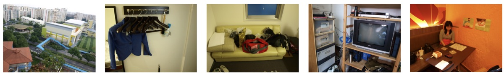</p>

- **Paper**: [Smoothly Varying Affine Stitching](https://ieeexplore.ieee.org/abstract/document/5995314), CVPR 2011
- **Project**: —
- **Download**: [Google Drive](https://drive.google.com/drive/folders/1FciKXGD0p_5Ly8_gQDkM2WUdSNRvxBuC?usp=sharing)
- **Details**: 5 image sets for stitching, each containing 2 to 3 images.


### APAP Dataset (2013)

<p align="center">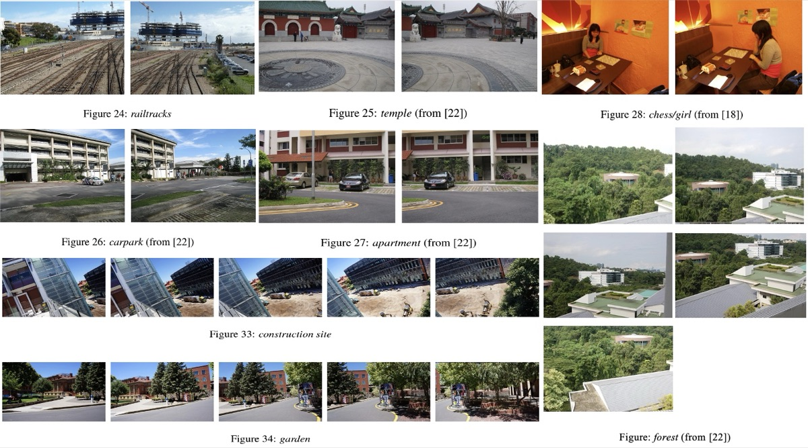</p>

- **Paper**: As-Projective-As-Possible Image Stitching with Moving DLT, [CVPR 2013](https://cs.adelaide.edu.au/~tjchin/apap/files/mdlt.pdf) / [TPAMI 2014](https://cs.adelaide.edu.au/~tjchin/apap/files/tpami_mdlt_lowres.pdf)
- **Project**: [Official](https://cs.adelaide.edu.au/~tjchin/apap/), [Python](https://github.com/EadCat/APAP-Image-Stitching), [C++](https://github.com/egoist-sx/AsProjectiveAsPossible)
- **Download**: [Project page](https://cs.adelaide.edu.au/~tjchin/apap/#Datasets)
- **Details**: 8 image sets: railtracks, temple, carpark, apartment, chess/girl, construction site, and garden. Part of the images come from SVA (CVPR 2011) and Dual-Homography Warping (CVPR 2011).


### Parallax-tolerant Stitching Dataset (2014)

<p align="center">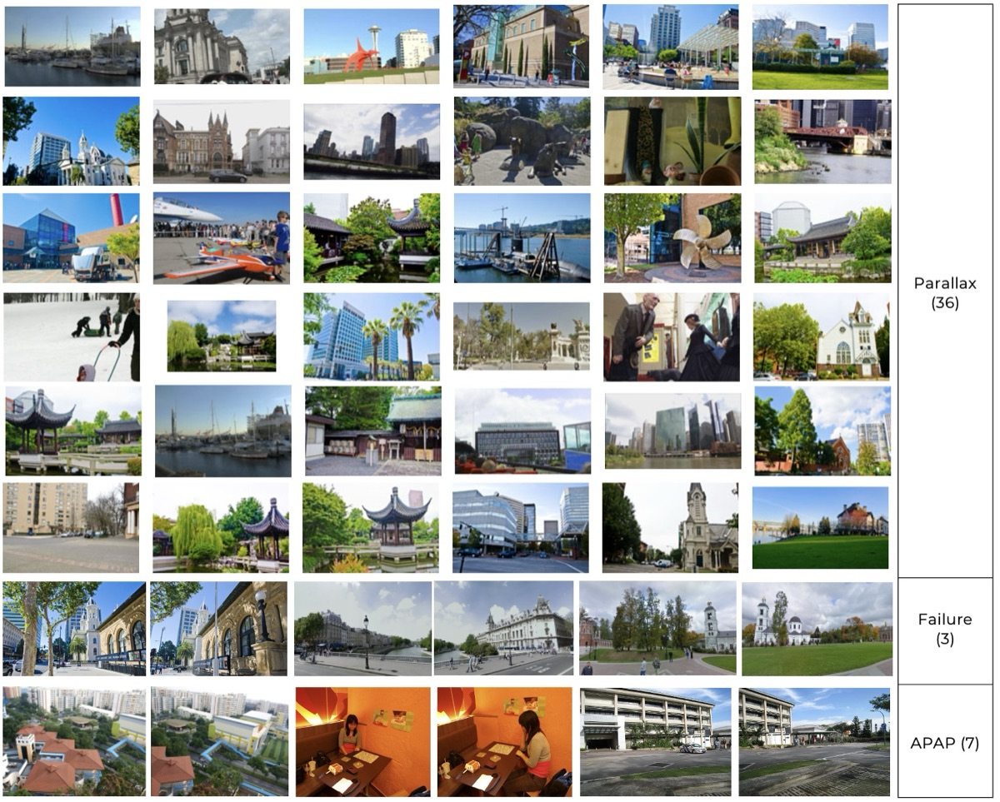</p>

- **Paper**: [Parallax-tolerant Image Stitching](https://pages.cs.wisc.edu/~fliu/papers/cvpr2014-stitching.pdf), CVPR 2014
- **Project**: [Official](https://pages.cs.wisc.edu/~fliu/project/stitch/index.htm)
- **Download**: [Zip](https://pages.cs.wisc.edu/~fliu/project/stitch/dataset.zip), [Browse images](https://web.cecs.pdx.edu/~fliu/project/stitch/dataset.html)
- **Details**: 36 image pairs for two-view stitching with noticeable parallax.


### SPHP Dataset (2014)

<p align="center">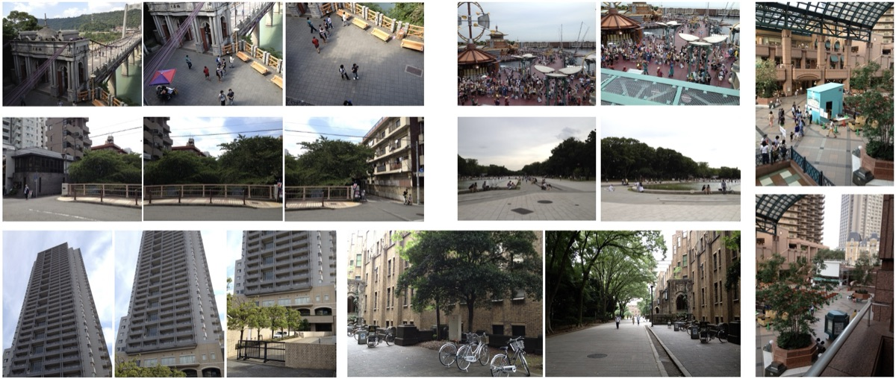</p>

- **Paper**: [Shape-Preserving Half-Projective Warps for Image Stitching](https://openaccess.thecvf.com/content_cvpr_2014/papers/Chang_Shape-Preserving_Half-Projective_Warps_2014_CVPR_paper.pdf), CVPR 2014. Related: [Spatially-Varying Image Warps for Scene Alignment](https://www.csie.ntu.edu.tw/~cyy/publications/papers/Chang2014SVI.pdf), ICPR 2014
- **Project**: [Official](https://www.ut-vision.org/publication/2014-chang-shape/)
- **Download**: [Google Drive](https://drive.google.com/drive/folders/1RRIXj4gn_qN93p58Sh1lUOxh_8L1RRr9?usp=sharing)
- **Details**: 7 additional image sets on top of the APAP dataset.


### Stereostitch Dataset (2015)

<p align="center">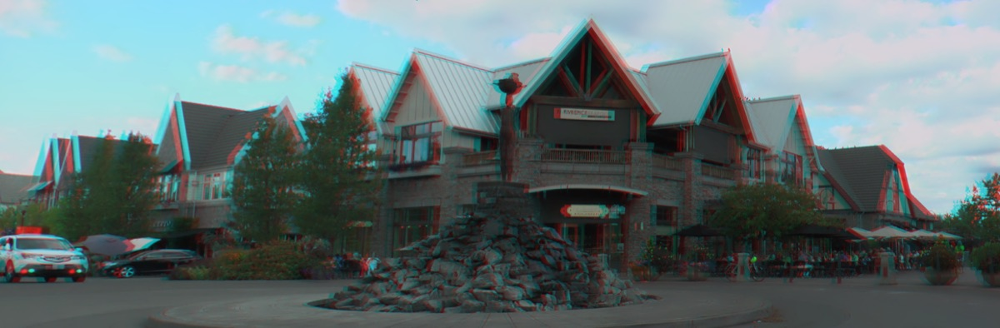</p>

- **Paper**: [Casual Stereoscopic Panorama Stitching](https://pages.cs.wisc.edu/~fliu/papers/cvpr2015-panorama.pdf), CVPR 2015
- **Project**: [Official](https://pages.cs.wisc.edu/~fliu/project/stereostitch/)
- **Download**: [Zip](https://pages.cs.wisc.edu/~fliu/project/stereostitch/dataset.zip)
- **Details**: 22 image sets (one for 360° stitching) captured with the stereo cameras Fujifilm FinePix 3D W3 and Panasonic HDC-Z10000. Each set includes left and right images with large parallax.


### NISwGSP Dataset (2016)

<p align="center">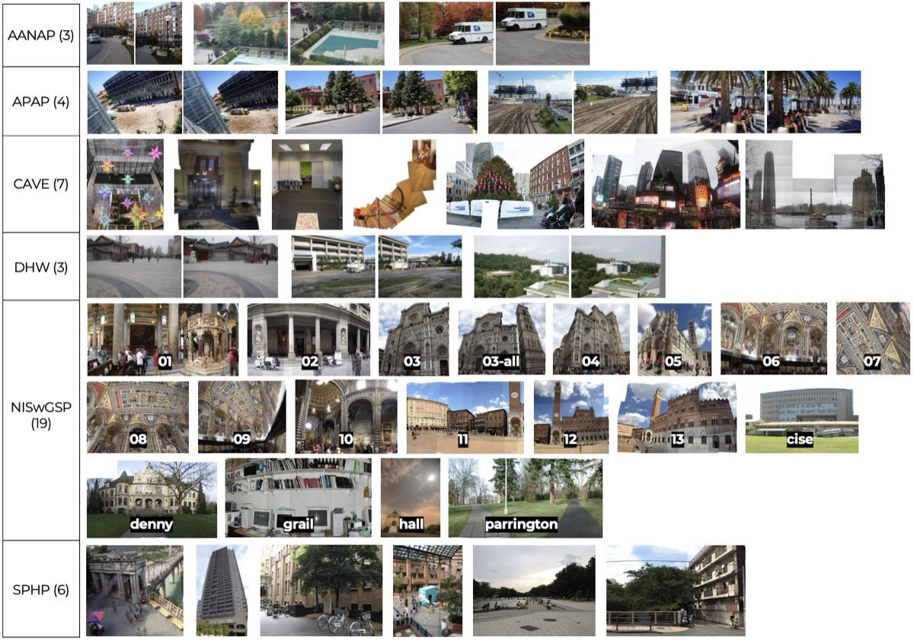</p>

- **Paper**: [Natural Image Stitching with the Global Similarity Prior](https://link.springer.com/chapter/10.1007/978-3-319-46454-1_12), ECCV 2016
- **Project**: [GitHub](https://github.com/nothinglo/NISwGSP)
- **Download**: [Google Drive](https://drive.google.com/drive/folders/1jzYBuLPbxH4Wrp7CN1IJtoR_cMwm-5OK?usp=sharing)
- **Details**: 42 image sets. Many sets contain more than two images for multi-image stitching.


### SEAGULL Dataset (2016)

<p align="center">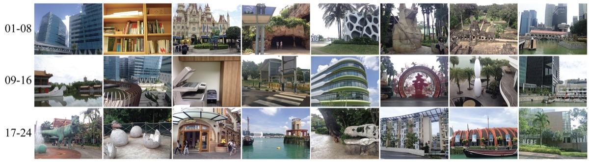</p>

- **Paper**: [SEAGULL: Seam-Guided Local Alignment for Parallax-Tolerant Image Stitching](https://link.springer.com/chapter/10.1007/978-3-319-46487-9_23), ECCV 2016
- **Project**: —
- **Download**: [Google Drive](https://drive.google.com/drive/folders/1_u5z4r7i8J4599v8ttNeXC8KJ8PiXV56?usp=sharing)
- **Details**: 24 image pairs captured by the authors with mobile phones, featuring challenging parallax.


### OpenPano Dataset (2016)

<p align="center">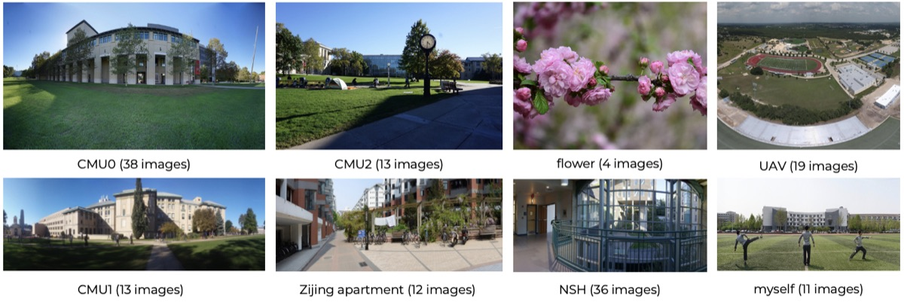</p>

- **Paper**: — (open-source panorama stitcher written in C++ from scratch)
- **Project**: [GitHub](https://github.com/ppwwyyxx/OpenPano)
- **Download**: [GitHub Release](https://github.com/ppwwyyxx/OpenPano/releases/tag/0.1)
- **Details**: 8 image sets for panorama stitching, each with 4 to 38 images.


### REW Dataset (2018)

<p align="center">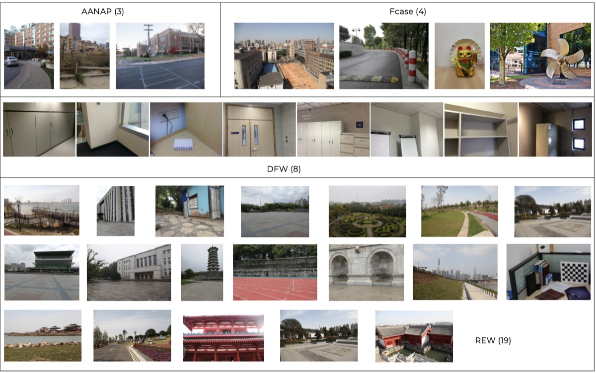</p>

- **Paper**: [Parallax-Tolerant Image Stitching Based on Robust Elastic Warping](https://ieeexplore.ieee.org/document/8119833), TMM 2018
- **Project**: [Official (MATLAB)](https://github.com/gain2217/Robust_Elastic_Warping), [Python](https://github.com/breadcake/python-Robust_Elastic_Warping)
- **Download**: [GitHub](https://github.com/gain2217/Robust_Elastic_Warping)
- **Details**: Two-view and multi-view image groups for stitching, shipped with the official code.


### Dataset for Stitching with Multiple Registrations (2018)

<p align="center">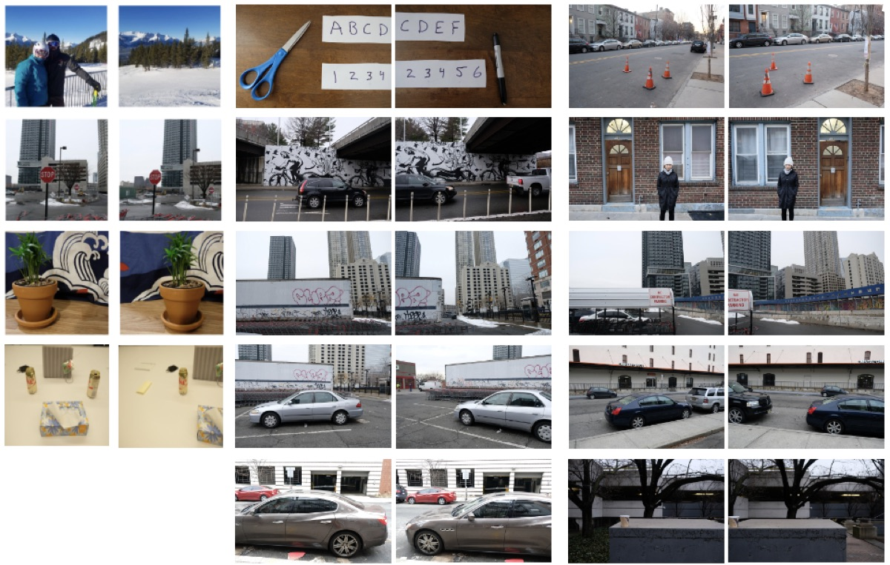</p>

- **Paper**: [Robust Image Stitching with Multiple Registrations](https://drive.google.com/file/d/1BWdkiJJHBSn9JNaMVhhD1WHD8upK51AH/view), ECCV 2018
- **Project**: [Official](https://sites.google.com/view/oois-eccv18/home?authuser=0)
- **Download**: [Google Drive](https://drive.google.com/open?id=1RNfs8I9NZu6A2FGT6Ba86nfEBOgbPdSp)
- **Details**: 14 image sets.


### Object-Centered Stitching Dataset (2018)

<p align="center">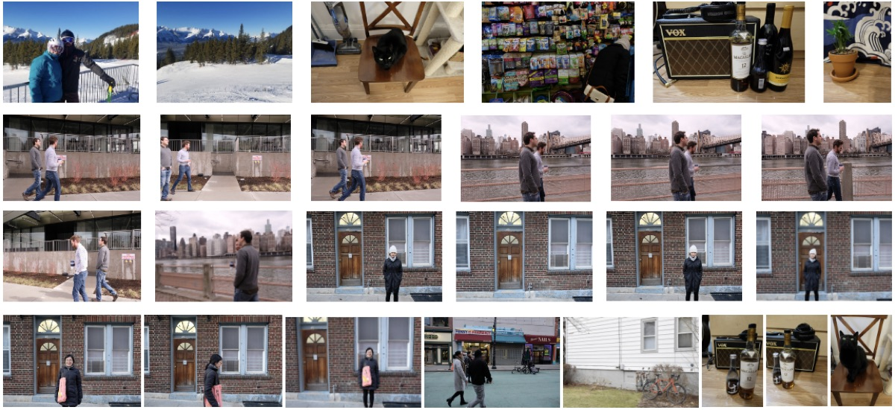</p>

- **Paper**: [Object-Centered Image Stitching](https://drive.google.com/file/d/1_YnPNNWzNphdrd_51lXL7q-jm5N3Cttn/view), ECCV 2018
- **Project**: [Official](https://sites.google.com/view/oois-eccv18/home?authuser=0)
- **Download**: [Google Drive](https://drive.google.com/open?id=1OIDwCcmVlSMqrLmwPBA8G2A5G4NgcQMF)
- **Details**: 26 image sets.


### BRAS Dataset (2019)

<p align="center">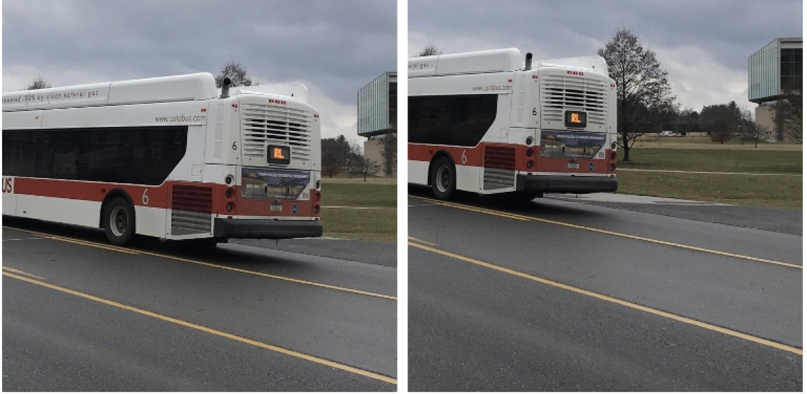</p>

- **Paper**: [Robust Alignment for Panoramic Stitching via an Exact Rank Constraint](https://ieeexplore.ieee.org/abstract/document/8684316), TIP 2019
- **Project**: [Official](http://signal.ee.psu.edu/research/BRAS.html)
- **Download**: [Project page](http://signal.ee.psu.edu/research/BRAS.html)
- **Details**: One group of CATA bus images for multi-image panoramic stitching.


### SPW Dataset (2020)

<p align="center">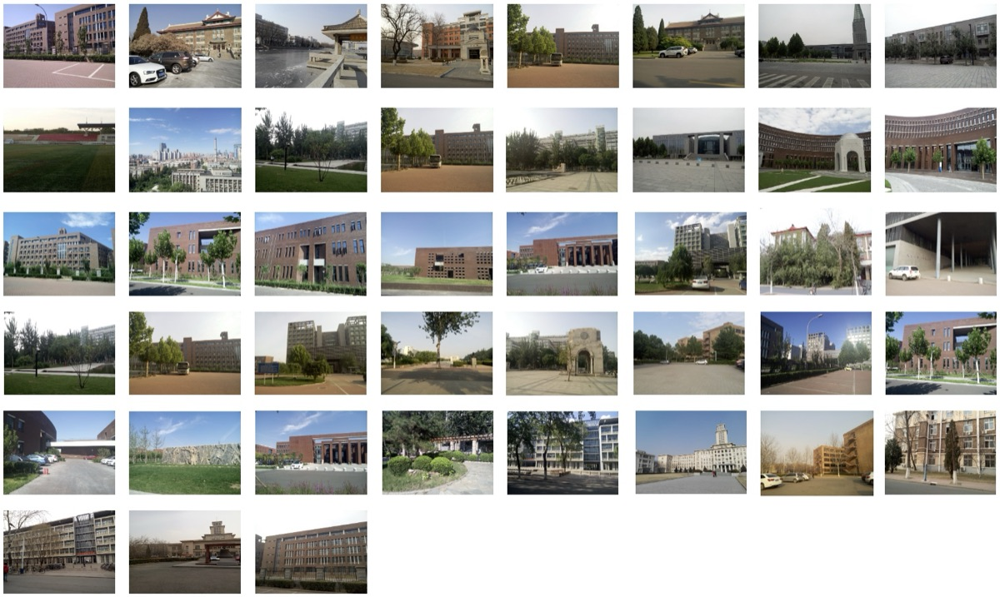</p>

- **Paper**: [Single-Perspective Warps in Natural Image Stitching](https://arxiv.org/abs/1802.04645), TIP 2020
- **Project**: [GitHub](https://github.com/tlliao/Single-perspective-warps)
- **Download**: [Two-image sets](https://github.com/tlliao/Single-perspective-warps/tree/master/TwoImage), [Multi-image sets](https://github.com/tlliao/Single-perspective-warps/tree/master/MultiImage)
- **Details**: 42 image pairs for two-view stitching plus several multi-image sets.


### VPG Dataset (2020)

<p align="center">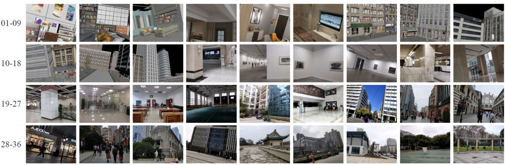</p>

- **Paper**: [Vanishing Point Guided Natural Image Stitching](https://arxiv.org/pdf/2004.02478.pdf), arXiv 2020
- **Project**: —
- **Download**: [Google Drive](https://drive.google.com/drive/folders/1n9Pf2vqNpT1r7QAjjYnVnwZu_OfuMRhW?usp=sharing)
- **Details**: 36 image sets: 12 synthetic sets rendered with 3ds Max (camera parameters known) and 24 real sets captured with a mobile phone. Indoor and outdoor street-view scenes satisfying the Manhattan assumption. Each set has 5 to 72 images.


### LPC Dataset (2021)

<p align="center">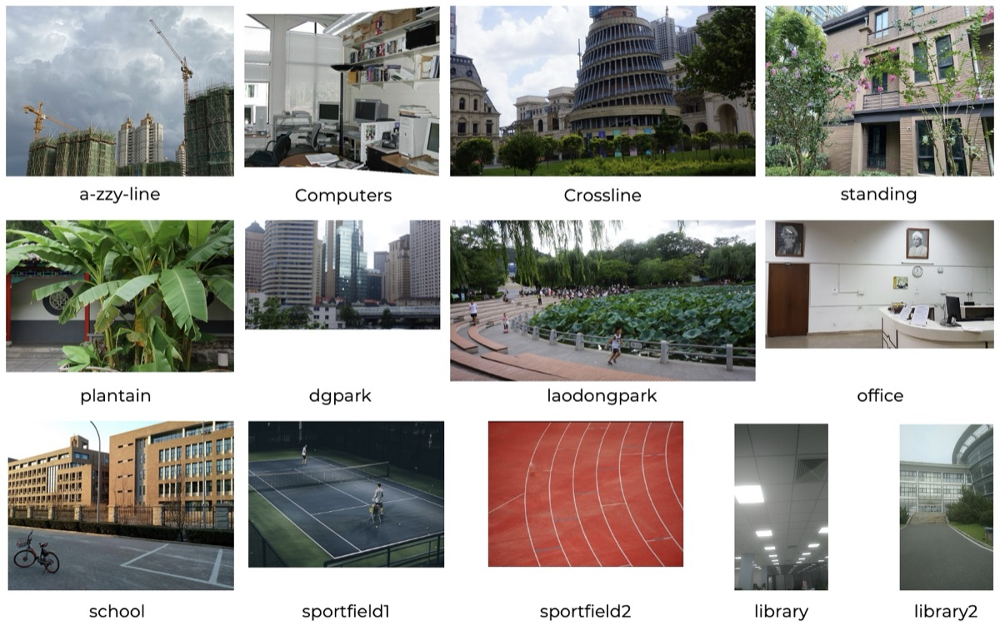</p>

- **Paper**: [Leveraging Line-Point Consistence to Preserve Structures for Wide Parallax Image Stitching](https://openaccess.thecvf.com/content/CVPR2021/papers/Jia_Leveraging_Line-Point_Consistence_To_Preserve_Structures_for_Wide_Parallax_Image_CVPR_2021_paper.pdf), CVPR 2021
- **Project**: [GitHub](https://github.com/dut-media-lab/Image-Stitching)
- **Download**: [GitHub](https://github.com/dut-media-lab/Image-Stitching/tree/main/Imgs)
- **Details**: About 13 new image pairs with wide parallax.


### GES-50 Dataset (2022)

<p align="center">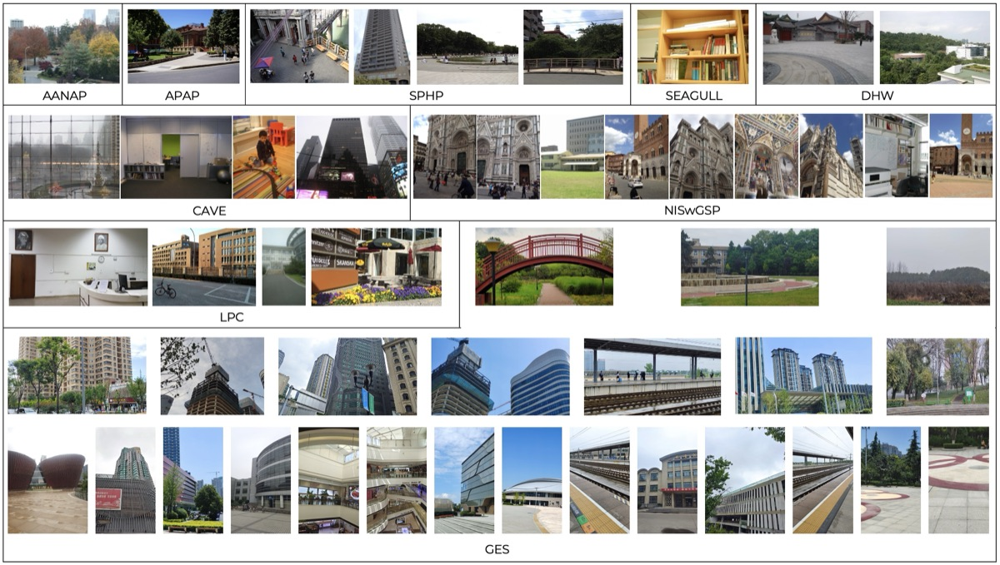</p>

- **Paper**: [Geometric Structure Preserving Warp for Natural Image Stitching](https://openaccess.thecvf.com/content/CVPR2022/html/Du_Geometric_Structure_Preserving_Warp_for_Natural_Image_Stitching_CVPR_2022_paper.html), CVPR 2022
- **Project**: [GitHub](https://github.com/flowerDuo/GES-GSP-Stitching)
- **Download**: [GitHub](https://github.com/flowerDuo/GES-GSP-Stitching/tree/master/Dataset)
- **Details**: 50 diverse and challenging image groups (26 from earlier datasets, 24 newly collected). Each group has 2 to 35 images.


### StitchBench (2025)

<p align="center">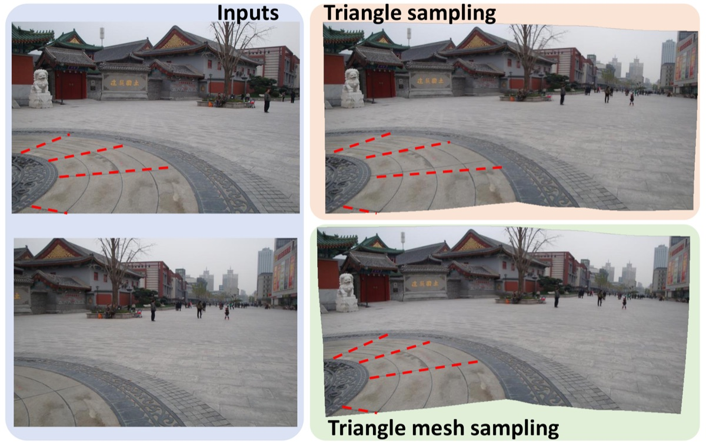</p>

- **Paper**: [Object-level Geometric Structure Preserving for Natural Image Stitching](https://arxiv.org/abs/2402.12677), AAAI 2025
- **Project**: [GitHub](https://github.com/RussRobin/OBJ-GSP)
- **Download**: [Hugging Face](https://huggingface.co/datasets/RussRobin/StitchBench) (gated, auto-approved)
- **Details**: A unified test benchmark of 122 image pairs. It merges the test images of 12 earlier works (AANAP, APAP, CAVE, DFW, DHW, GES-GSP, LPC, SEAGULL, REW, SVA, SPHP, and others) and adds 18 handheld pairs plus 7 low-altitude drone scenes captured with a DJI Mavic Air 2 at 100–120 m. Organised into `General/` and `Aerial/` folders. License CC BY 4.0.


### RopStitch-147 (2026)

<p align="center">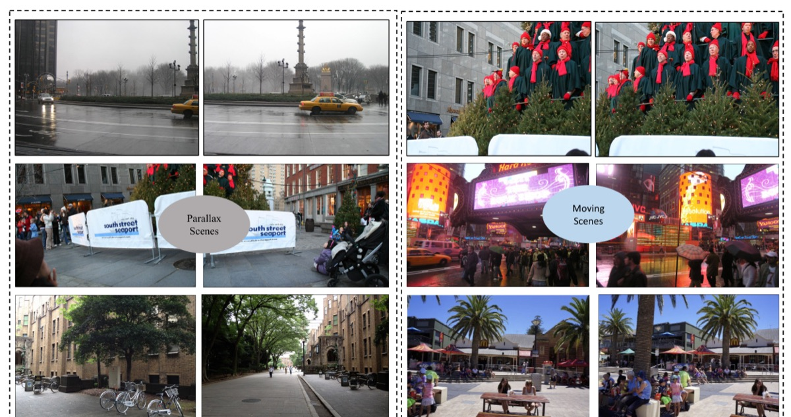</p>

- **Paper**: [Robust Image Stitching with Optimal Plane](https://arxiv.org/abs/2508.05903), TVCG 2026
- **Project**: [GitHub](https://github.com/MmelodYy/RopStitch)
- **Download**: [Google Drive](https://drive.google.com/file/d/1_F7M7DN7K4BjZPEcez7XS6TUpE3iEX8f/view?usp=drive_link)
- **Details**: 147 classical two-view stitching pairs assembled for cross-scenario (zero-shot) evaluation of learning-based stitchers, sourced mainly from AANAP, SPHP, NISwGSP, and other traditional stitching papers. Covers parallax, moving objects, lighting changes, and resolution differences. Also used by UniStitch (2026).


## Deep Learning Image Stitching

### UDIS-D (2021)

<p align="center">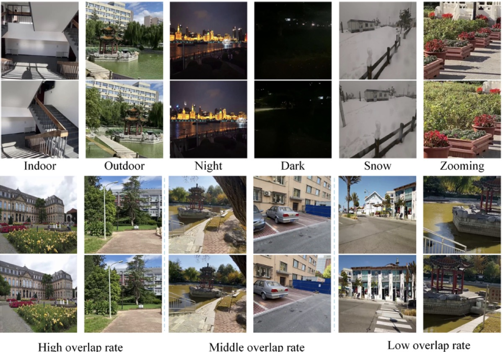</p>

- **Paper**: [Unsupervised Deep Image Stitching: Reconstructing Stitched Features to Images](https://arxiv.org/abs/2106.12859), TIP 2021. Related: [Parallax-Tolerant Unsupervised Deep Image Stitching (UDIS++)](https://arxiv.org/abs/2302.08207), ICCV 2023, [code](https://github.com/nie-lang/UDIS2)
- **Project**: [GitHub](https://github.com/nie-lang/UnsupervisedDeepImageStitching)
- **Download**: [GitHub](https://github.com/nie-lang/UnsupervisedDeepImageStitching)
- **Details**: Real-world unsupervised stitching dataset with 10,440 training pairs and 1,106 testing pairs, covering indoor, outdoor, night, dark, snow, and zooming scenes with varying overlap rates.


### ASIS (2025)

<p align="center">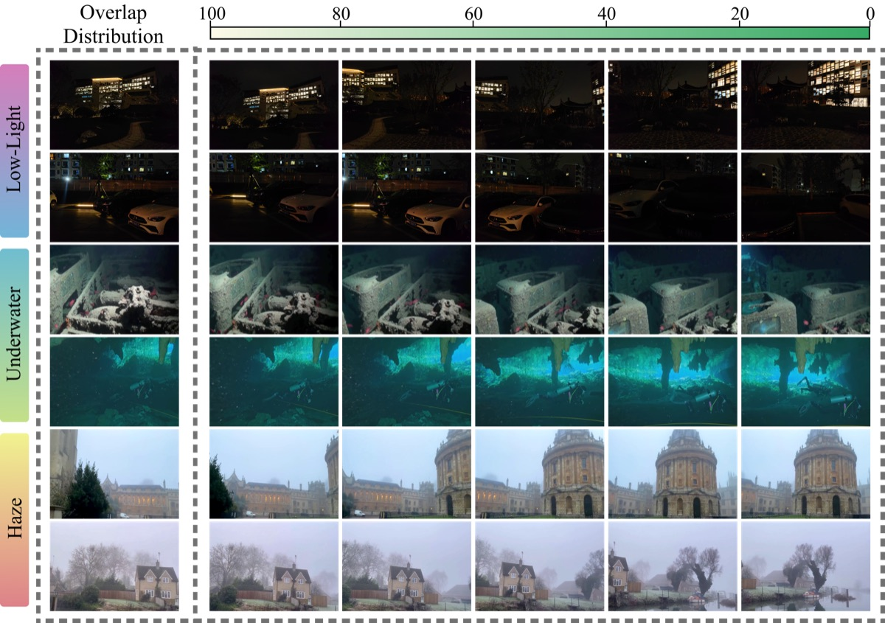</p>

- **Paper**: [Image Stitching in Adverse Condition: A Bidirectional-Consistency Learning Framework and Benchmark](https://neurips.cc/virtual/2025/loc/san-diego/poster/116320), NeurIPS 2025
- **Project**: [GitHub](https://github.com/ZengxiZhang/ACDIS)
- **Download**: [Google Drive](https://drive.google.com/file/d/1YUhftGg9xip5Ff7qxtSo30fdnANXos1j/view?usp=sharing), [Baidu Cloud](https://pan.baidu.com/s/1pzxIGRQI9vA4DZH8aXzZAw?pwd=6a1d) (code: 6a1d)
- **Details**: Adverse Scene Image Stitching dataset, the first stitching benchmark for degraded conditions. 2,250 image pairs, 750 each for low-light, haze, and underwater, over 17 scenes such as caves, wrecks, and fields. Images come from the internet and the authors' own capture, chosen away from planar structures to keep parallax diverse. Homography reference labels are provided.


## Video Stitching

### StabStitch-D (2024)

<p align="center">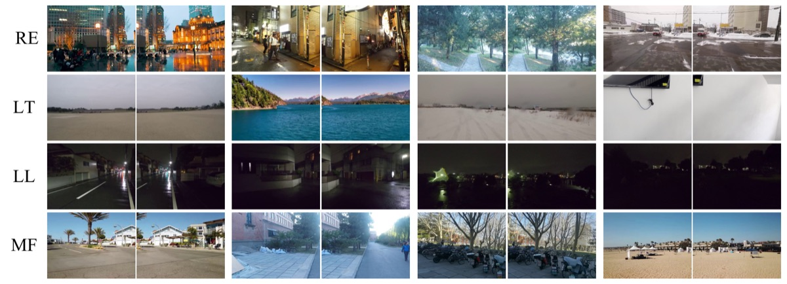</p>

- **Paper**: [Eliminating Warping Shakes for Unsupervised Online Video Stitching](https://arxiv.org/abs/2403.06378), ECCV 2024. Related: [StabStitch++](https://arxiv.org/abs/2505.05001), TPAMI 2025, [code](https://github.com/nie-lang/StabStitch2)
- **Project**: [GitHub](https://github.com/nie-lang/StabStitch)
- **Download**: [Google Drive](https://drive.google.com/drive/folders/16EDGrKOLLwcMseOjpI7bCrv_aP1MYVcz?usp=sharing), [Baidu Cloud](https://pan.baidu.com/s/1TKQAQ9zryUuU4uzTiswfHg) (code: 1234)
- **Details**: The first large-scale video stitching dataset. Over 100 video pairs and 100k+ frames, 5 to 35 s each, in four classes: regular (RE), low-texture (LT), low-light (LL), and fast-moving (FM, labelled MF in the figure). The test set has 20 pairs, 5 per class. Training videos are resized to 360×480. StabStitch++ additionally evaluates on 31 challenging pairs collected from earlier video stitching papers.


## Panoramic and Surround-view Stitching

### WSSN Dataset (2022)

<p align="center">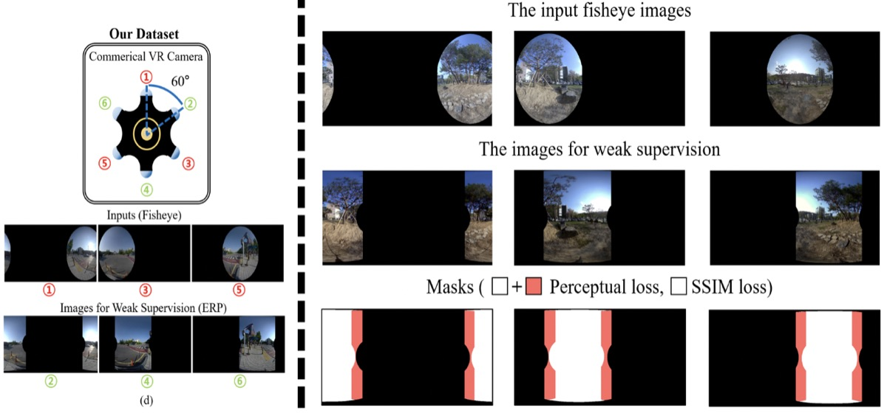</p>

- **Paper**: [Weakly-Supervised Stitching Network for Real-World Panoramic Image Generation](https://arxiv.org/abs/2209.05968), ECCV 2022
- **Project**: [Official](https://eadcat.github.io/WSSN/), [code](https://github.com/EadCat/WeaklySupervisedStitchingNetwork)
- **Download**: [Google Drive](https://drive.google.com/file/d/1p27k77TWjknBYJ62EW97D2Xf_nElNZW3/view?usp=sharing)
- **Details**: Fisheye dataset captured with the Kandao Obsidian R VR camera, which has six lenses at 60° intervals. Three fisheye images (0°, 120°, 240°) are inputs and the other three (60°, 180°, 300°) serve as weak supervision. 47,063 training sets and 1,400 test sets; each training set contains three fisheye inputs, three ERP images, and three masks.


### GV360 (2024)

<p align="center">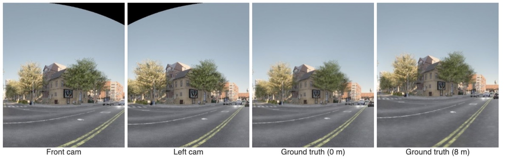</p>

- **Paper**: [OmniStitch: Depth-Aware Stitching Framework for Omnidirectional Vision with Multiple Cameras](https://dl.acm.org/doi/10.1145/3664647.3681208), ACM MM 2024
- **Project**: [GitHub](https://github.com/tngh5004/Omnistitch)
- **Download**: [Hugging Face](https://huggingface.co/datasets/tngh5004/GV360) (test set 104 MB, training set 11 GB)
- **Details**: Synthetic multi-camera omnidirectional stitching dataset rendered with the CARLA simulator for vehicle-agnostic ADAS systems. Each sample pairs a front or back camera with a left or right camera and provides a ground-truth stitched view that keeps the 360° perspective, at 480×576. Four inter-camera distance settings (0, 5, 8, and 14 m) simulate different vehicle sizes and distance parallax. The generation scripts are included in the repository.


## Aerial and Remote Sensing Stitching

### Aerial Image Stitching (AIS) Datasets

- **Aerial Images of Virginia Beach**: [Open Data Portal](https://gis.data.vbgov.com/datasets/824c57d560e648079cb4ed2ca763774c/explore)
- **OpenDroneMap Data**: [ODMData](https://www.opendronemap.org/odm/datasets/)
- **PlanarMosaicking Data**: [Paper (PR 2017)](https://www.sciencedirect.com/science/article/abs/pii/S0031320317300201), [Code](https://github.com/MenghanXia/AutoStitching), [Google Drive](https://drive.google.com/drive/folders/1W5e4lWo7S3gfwyYh9lN3sxQ-YuU3W2Ly?usp=sharing)
- **UAVMosaicking Data**: [Paper (Remote Sensing 2016)](https://www.mdpi.com/2072-4292/8/3/204), [Google Drive](https://drive.google.com/file/d/1sUI_iwCrwgMB4JKZff0wy0DLXY8A8d0c/view?usp=sharing)


### UDAIS-D and UDAIS-D+ (2025)

<p align="center">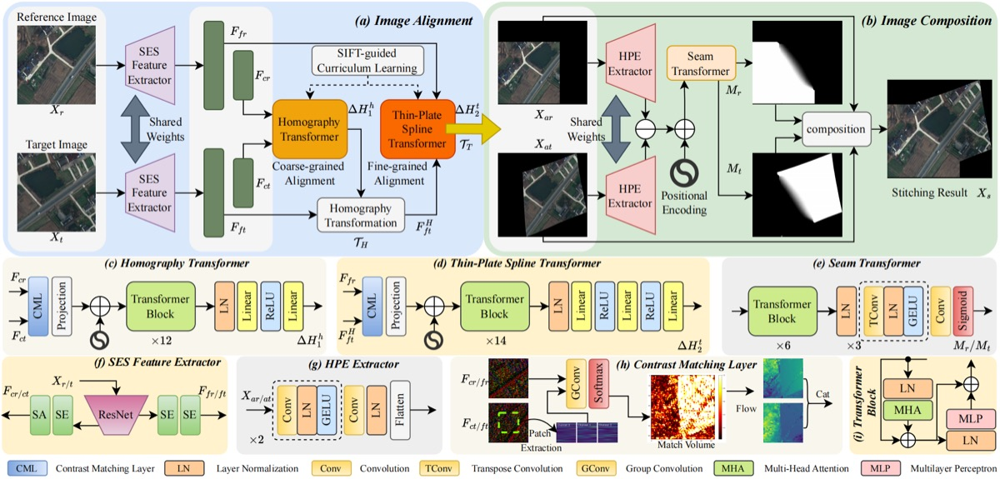</p>

- **Paper**: [Unsupervised Deep Image Stitching for Remote Sensing: Aligning Features Across Large-Scale Geometric Distortions](https://ieeexplore.ieee.org/document/11164964), JSTARS 2025. Related: [Radiation-Tolerant Unsupervised Deep Image Stitching for Remote Sensing](https://ieeexplore.ieee.org/document/11146793), TGRS 2025
- **Project**: [UDRSIS](https://github.com/yyywxk/UDRSIS), [RT-UDRSIS](https://github.com/yyywxk/RT-UDRSIS)
- **Download**: UDAIS-D on [Baidu Cloud](https://pan.baidu.com/s/1U0Bw7DZGM5J8mAK8mwsxFw?pwd=1234) (code: 1234), UDAIS-D+ on [Baidu Cloud](https://pan.baidu.com/s/1cXSOosWZbIg9CSu_iRmSyw?pwd=1234) (code: 1234)
- **Details**: Unsupervised Deep Stitching of Aerial Images Dataset, the first benchmark for deep remote-sensing image stitching. Simulated pairs cover a wide range of geometric distortions, radiometric distortions, and noise; real pairs are collected from actual remote-sensing imagery. UDAIS-D+ extends it with stronger radiation differences for the TGRS follow-up. Exact split sizes are given in the papers.


### Aerial234 (2025)

<p align="center">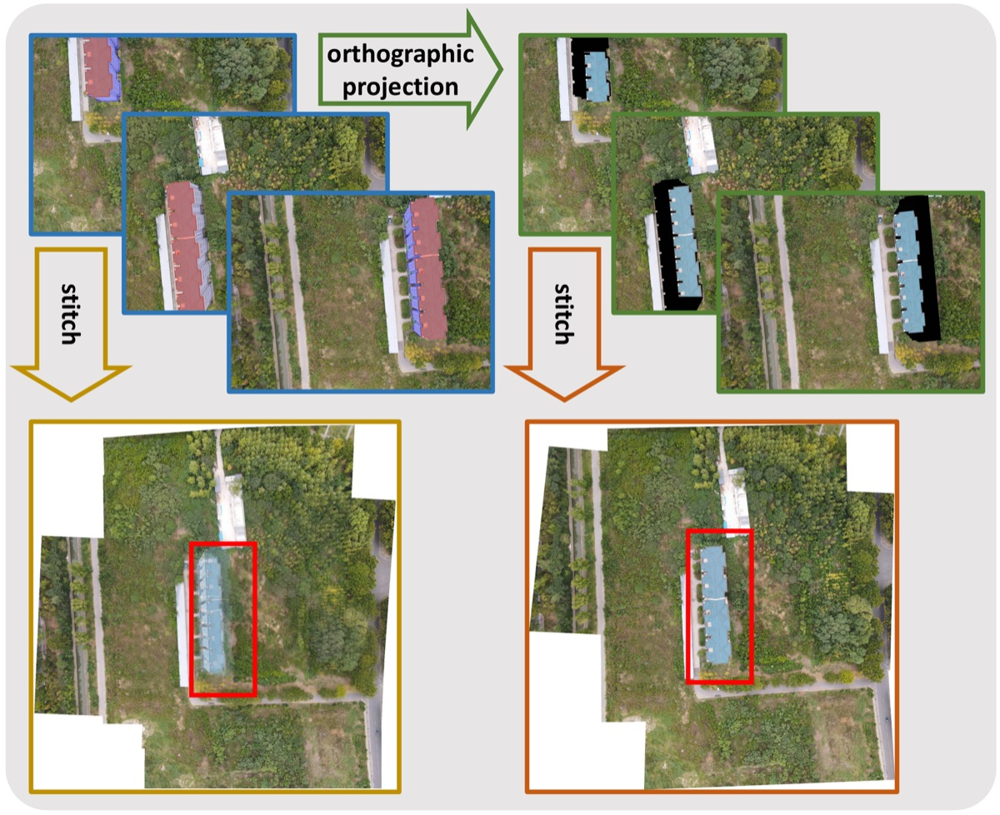</p>

- **Paper**: [Object-level Geometric Structure Preserving for Natural Image Stitching](https://arxiv.org/abs/2402.12677), AAAI 2025 (aerial extension)
- **Project**: [GitHub](https://github.com/RussRobin/OBJ-GSP)
- **Download**: [Hugging Face](https://huggingface.co/datasets/RussRobin/Aerial234) (gated, auto-approved)
- **Details**: 234 consecutive low-altitude drone photographs captured over the Southeast University campus, released as a single challenging sequence for large-scale multi-image aerial stitching. The authors pose stitching all 234 images into one panorama as an open challenge.


## Rectangling and Rotation Correction

### DIR-D (2022)

<p align="center">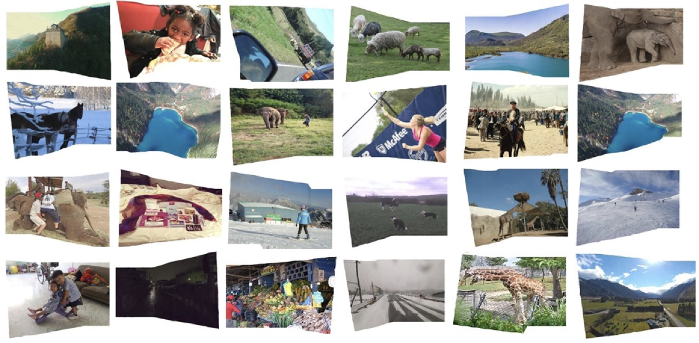</p>

- **Paper**: [Deep Rectangling for Image Stitching: A Learning Baseline](https://arxiv.org/pdf/2203.03831.pdf), CVPR 2022
- **Project**: [GitHub](https://github.com/nie-lang/DeepRectangling)
- **Download**: [Google Drive](https://drive.google.com/file/d/1KR5DtekPJin3bmQPlTGP4wbM1zFR80ak/view?usp=sharing)
- **Details**: Rectangling dataset with 5,839 training and 519 testing samples at 512×384. Synthesized from UDIS-D and MS-COCO. Each sample is a triplet: stitched image, mask, and rectangling label.


### DRC-D (2023)

<p align="center">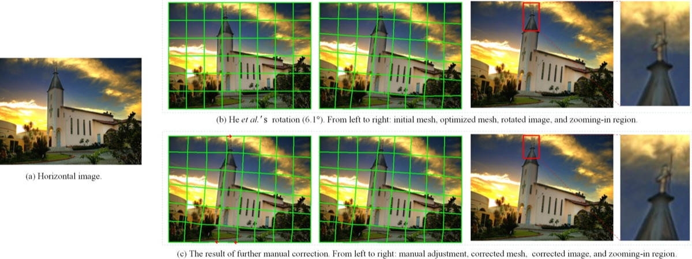</p>

- **Paper**: [Deep Rotation Correction without Angle Prior](https://arxiv.org/abs/2207.03054), TIP 2023
- **Project**: [GitHub](https://github.com/nie-lang/RotationCorrection)
- **Download**: [GitHub](https://github.com/nie-lang/RotationCorrection) (Google Drive and Baidu Cloud links in the README)
- **Details**: Deep Rotation Correction dataset with 5,537 training and 665 testing samples at 384×512. Each sample is a triplet of a tilted input image, its tilt angle, and a manually rectified corrected label. Candidates were generated with He et al.'s content-aware rotation and then filtered and refined by hand.


### AIRD (2024)

<p align="center">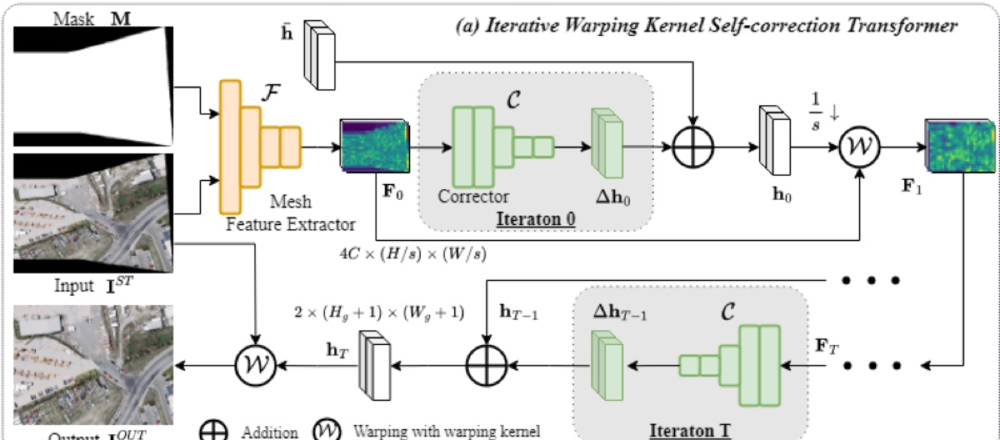</p>

- **Paper**: [Remote Sensing Image Rectangling with Iterative Warping Kernel Self-correction Transformer](https://ieeexplore.ieee.org/document/10632108), TGRS 2024
- **Project**: [GitHub](https://github.com/yyywxk/IWKFormer)
- **Download**: [Baidu Cloud](https://pan.baidu.com/s/1oklVqzmjfluqJdwq1R_xlw?pwd=1234) (code: 1234)
- **Details**: Aerial Imagery Stitching Rectangling Dataset, the remote-sensing counterpart of DIR-D. Samples are stitched aerial images with irregular boundaries, masks, and rectangling labels. The same code also trains on DIR-D. Exact split sizes are given in the paper.


## Homography Estimation

### Hmg-dynamics (2020)

<p align="center">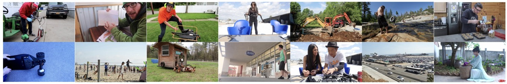</p>

- **Paper**: [Deep Homography Estimation for Dynamic Scenes](https://openaccess.thecvf.com/content_CVPR_2020/papers/Le_Deep_Homography_Estimation_for_Dynamic_Scenes_CVPR_2020_paper.pdf), CVPR 2020
- **Project**: [GitHub](https://github.com/lcmhoang/hmg-dynamics)
- **Download**: [GitHub](https://github.com/lcmhoang/hmg-dynamics)
- **Details**: 877 Creative Commons videos from YouTube, from which 32,385 static clips were extracted. A known homography sequence is applied to each clip to generate image and video pairs with ground truth.


### Content-Aware-DeepH-Data (2020)

<p align="center">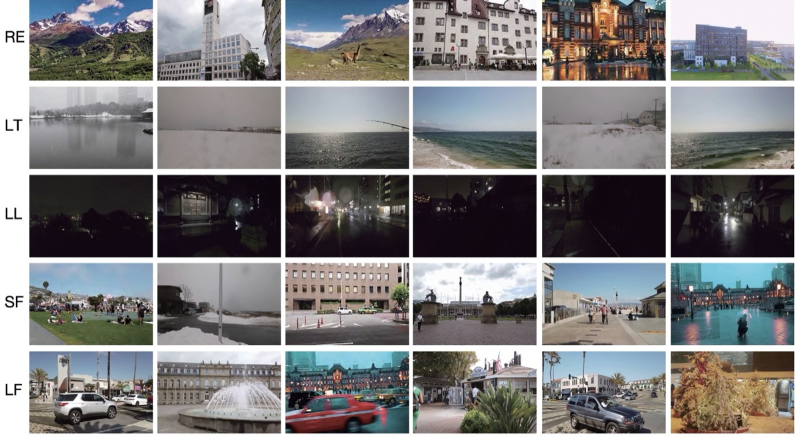</p>

- **Paper**: [Content-Aware Unsupervised Deep Homography Estimation](https://arxiv.org/pdf/1909.05983.pdf), ECCV 2020. Related: [LBHomo](https://github.com/megvii-research/LBHomo), AAAI 2023; [RealSH](https://github.com/JianghaiSCU/RealSH), ICCV 2023; [DMHomo](https://github.com/lhaippp/DMHomo), TOG 2024 (all build on this data)
- **Project**: [GitHub](https://github.com/JirongZhang/DeepHomography)
- **Download**: [Google Drive](https://drive.google.com/file/d/19d2ylBUPcMQBb_MNBBGl9rCAS7SU-oGm/view?usp=sharing)
- **Details**: About 80k image pairs in 5 categories, roughly 16k pairs each: regular (RE), low-texture (LT), low-light (LL), small-foreground (SF), and large-foreground (LF). The test split has 4.2k pairs randomly drawn from all categories.


### HEB (2023)

<p align="center">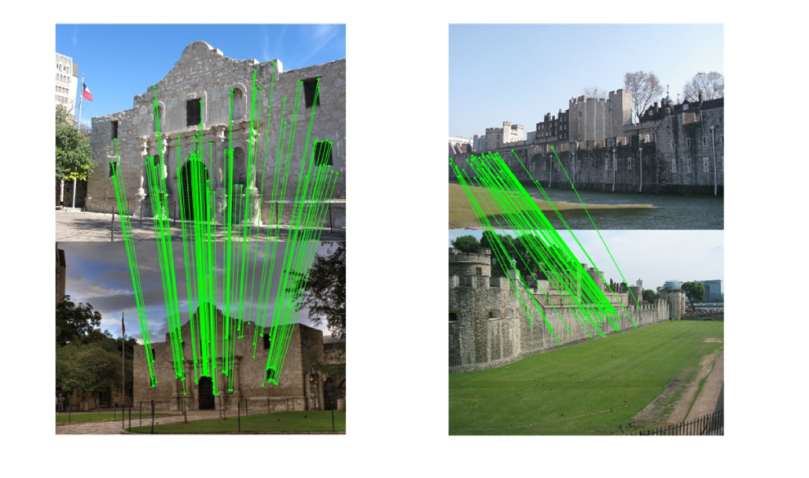</p>

- **Paper**: [A Large Scale Homography Benchmark](https://arxiv.org/abs/2302.09997), CVPR 2023
- **Project**: [GitHub](https://github.com/danini/homography-benchmark)
- **Download**: [GitHub](https://github.com/danini/homography-benchmark) (hosted on ETH Polybox, link in the README)
- **Details**: Large-scale real-world homography benchmark built from the Pi3D planes of the 1DSfM dataset: about 1,000 planes observed in 10,000 images, giving 226,260 ground-truth homographies and roughly 4M correspondences across 11 landmark scenes (Alamo, Tower of London, Roman Forum, and others). Image pairs undergo large viewpoint and illumination changes, which makes it a useful wide-baseline test for stitching alignment.


## Other Related Datasets

### Color Consistency Dataset (2019)

<p align="center">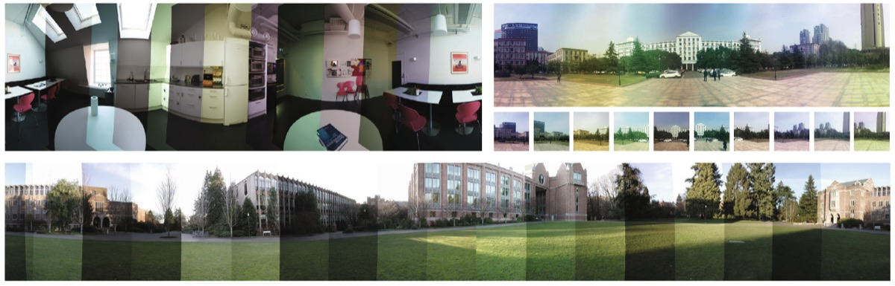</p>

- **Paper**: [A Closed-Form Solution for Multi-view Color Correction with Gradient Preservation](https://doi.org/10.1016/j.isprsjprs.2019.09.004), ISPRS Journal 2019
- **Project**: [GitHub](https://github.com/MenghanXia/ColorConsistency)
- **Download**: [GitHub](https://github.com/MenghanXia/ColorConsistency), [Google Drive](https://drive.google.com/drive/folders/1bXhFKNYrLVburN4l6q-nZfe7Vrq1YdyE?usp=sharing)
- **Details**: 3 image sets for color correction in stitching: campus, lunchroom, and school building.


## Announced, Not Yet Released

Datasets described in published papers whose download links were not yet public when this list was last updated. Entries move to the sections above once data is available.

| Dataset                                                            | Year  | Venue  | Description                                                                                                                                 | Status                             |
| :----------------------------------------------------------------- | :---: | :----: | :------------------------------------------------------------------------------------------------------------------------------------------ | :--------------------------------- |
| [ChaMS](https://github.com/Jzy2017/SGR-MSIS)                       | 2023  | ACM MM | Challenging multi-spectral (infrared + visible) stitching set with real and synthetic pairs under large parallax                            | README says "available soon"       |
| [PIS3R](https://github.com/zmhcasmy/PIS3R)                         | 2025  | arXiv  | Very large parallax stitching: 20 synthetic Blender scenes (600 pairs) and 10 real phone-captured scenes (682 pairs), all with ground truth | Code and data "coming soon"        |
| [Generative Panoramic Stitching](https://arxiv.org/abs/2507.07133) | 2026  | CVPRW  | Tripod-captured multi-reference scenes with parallax and lighting variation for generative stitching                                        | Paper states data will be released |


## Contributing

Contributions are welcome. To add a dataset, open a pull request that

1. adds a row to the [Overview](#overview) table under the right category,
2. adds an entry in the matching section using the template below, and
3. places a preview image (JPEG, about 1200 px wide, under 300 KB) in `imgs/`.

```markdown
### Name Dataset (Year)

<p align="center"></p>

- **Paper**: [Title](link), Venue Year
- **Project**: [GitHub](link) or —
- **Download**: [Google Drive](link)
- **Details**: number of sets, images per set, capture device, scene types, splits.
```

If a link is broken, please open an issue or send a fix.
