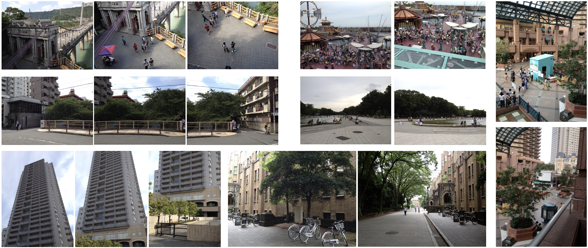

# Image Stitching by Line-guided Local Warping with Global Similarity Constraint (PR2018)

A collection of image stitching datasets used for image stitching by line-guided local warping with global similarity constraint, PR, 2018. 

Recent image stitching work can be found in: [awesome-computational-photography](https://github.com/visionxiang/awesome-computational-photography).

<!--
Dataset Name
Imgs
Paper: 
Project: 
Download:  
Related paper
Details
--> 

## Traditional Image Stitching

### APAP Dataset (2014)

&emsp;   
- Paper: As-Projective-As-Possible Image Stitching with Moving DLT, [CVPR2013](https://cs.adelaide.edu.au/~tjchin/apap/files/mdlt.pdf), [TPAMI2014](https://cs.adelaide.edu.au/~tjchin/apap/files/tpami_mdlt_lowres.pdf)    
- Project: [Official](https://cs.adelaide.edu.au/~tjchin/apap/), [Python Code](https://github.com/EadCat/APAP-Image-Stitching)  
- Download: https://cs.adelaide.edu.au/~tjchin/apap/#Datasets  
- Dataset: 8 sets of images, including railtracks, temple, carpark, apartment, chess/girl, construction site, and garden.    
- Reference:   
[18] Smoothly varying affine stitching, CVPR2011.   
[22] Constructing image panoramas using dual-homography warping, CVPR2011.

<!--BAMDLT code is expired. Dataset No couch(from[18]), bikes -->

### Parallax-tolerant Stitching Dataset (2014)

&emsp;       
- Paper: [Parallax-tolerant Image Stitching](https://pages.cs.wisc.edu/~fliu/papers/cvpr2014-stitching.pdf), CVPR2014  
- Project: https://pages.cs.wisc.edu/~fliu/project/stitch/index.htm  
- Download: https://pages.cs.wisc.edu/~fliu/project/stitch/dataset.zip   
- Dataset: The dataset contains 36 sets of images for two-view image stitching.   

### SPHP Dataset (2014)

&emsp;     
- Paper: [Shape-Preserving Half-Projective Warps for Image Stitching](https://openaccess.thecvf.com/content_cvpr_2014/papers/Chang_Shape-Preserving_Half-Projective_Warps_2014_CVPR_paper.pdf), CVPR2014  
- Related Paper: [Spatially-Varying Image Warps for Scene Alignment](https://www.csie.ntu.edu.tw/~cyy/publications/papers/Chang2014SVI.pdf), ICPR2014  
- Project: [Code]  
- Download: [Google Drive]()  
- Dataset: Add another 7 sets of images for image stitching based on the APAP dataset.   

### Stereostitch Dataset (2015)

&emsp;     
- Paper: [Casual Stereoscopic Panorama Stitching](https://pages.cs.wisc.edu/~fliu/papers/cvpr2015-panorama.pdf), CVPR2015  
- Project: https://pages.cs.wisc.edu/~fliu/project/stereostitch/   
- Download: https://pages.cs.wisc.edu/~fliu/project/stereostitch/dataset.zip  
- Dataset: The dataset contains 22 sets of images (incl. one group of images for 360 stitching), taken by stereo cameras Fujifilm FinePix 3D W3 and Panasonic HDC-Z10000. Each set of images includes both the left images and right images exhibiting large parallax.  

### NISwGSP Dataset (2016)

&emsp;    
- Paper: [Natural Image Stitching with the Global Similarity Prior](https://link.springer.com/chapter/10.1007/978-3-319-46454-1_12), ECCV2016   
- Project: https://github.com/nothinglo/NISwGSP  
- Download: [Google Drive]()  
- Dataset: it contains 42 sets of images for image stitching. Many sets of images contain multiple images (> 2) for stitching.   

### SEAGULL Dataset (2016)

&emsp;    
- Paper: [SEAGULL: Seam-Guided Local Alignment for Parallax-Tolerant Image Stitching](https://link.springer.com/chapter/10.1007/978-3-319-46487-9_23), ECCV2016   
- Project:  
- Download: (Link expired)
- Dataset: it contains 24 pairs of images taken by the author using mobile phones with challenging parallax variation.

## Deep Learning Image Stitching

### UDIS-D

&emsp; 

- Paper: [Unsupervised Deep Image Stitching: Reconstructing Stitched Features to Images](https://arxiv.org/abs/2106.12859), TIP2021  
- Project: https://github.com/nie-lang/UnsupervisedDeepImageStitching  
- Download: https://github.com/nie-lang/UnsupervisedDeepImageStitching 
- Related Paper: [Parallax-Tolerant Unsupervised Deep Image Stitching](https://arxiv.org/abs/2302.08207), ICCV2023, [[``Proj``]](https://github.com/nie-lang/UDIS2)
- Dataset: It is an unsupervised deep image stitching dataset, including 10,440 cases for training and 1,106 for testing.

